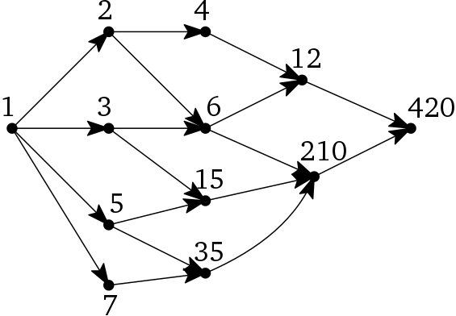

```{r setup, include=FALSE}
knitr::opts_chunk$set(echo = TRUE)
knitr::opts_chunk$set(comment = NA)
```

This page contains the content of all the slides for the material that we covered in Chapters 4-6 of [Algorithms](http://jeffe.cs.illinois.edu/teaching/algorithms/book/Algorithms-JeffE.pdf), by Jeff Erickson. If you notice any errors, please [create a new issue](https://github.com/djhunter/algorithms/issues).

# Greedy Algorithms

## The Greedy Choice

- Problem: Find the optimal (e.g., cheapest/best) long-term sequence of choices.
- A *greedy algorithm* makes the cheapest/best short-term choice at each stage of the process.

We saw some examples where the greedy choice *doesn't* work:

- Change-making in Nadirian currency.
- Candy Swap Saga

## Greedy vs. Dynamic Programming

- Both solve *optimization* problems.
- Problems have *recursive substructure.*
   - Make a choice, then optimize the remainder.
- There is one **key difference:**
    - In the dynamic programming solutions, we had to try all the different choices at each stage.
        - Churro cutting: Try all the different cuts, then optimize the rest.
        - Candy swap: Try swapping and not swapping, then optimize the rest.
    - A greedy algorithm just makes the optimal *short-term* choice.
        - Cut off the most expensive piece.
        - Never swap for a different candy.
   
## Isn't this easy?

- Writing greedy algorithms is easy. (And they're usually fast.)
- The hard part is **proving that they actually give you an optimal solution.**

# Scheduling

## Maximize the number of events

- You have a list of potential events to schedule (e.g., Fringe Festival skits.)
   - Each event has a starting time $S[i]$ and a finish time $F[i]$.
   - You only have one stage. 

- The organizer of the festival only cares about *maximizing the number* of events.
- Which events should you choose?

## Table Groups

```{r, echo=FALSE}
library(knitr)
roster <- c("Ethan", "Talia", "Drake", "Jack", "Andrew", "Blake", "Jordan", "Graham", "Kevin", "Logan", "Claire", "Bri", "Trevor", "James", "Kristen", "Levi", "Grace", "John", "Isaac", "Josiah", "Nathan")
set.seed(2122021) 
n <- length(roster)
ngps <- 7
maxingp <- ceiling(n/ngps)
# just make random groups
groups <- matrix(c(roster[sample(n)], 
                   rep("",(maxingp - (n %% maxingp)) %% maxingp)), 
                 ncol=maxingp, byrow=FALSE)
rownames(groups) <- paste0("Table #", 1:nrow(groups))
kable(t(groups))
```

## How many can you schedule?

```{r, echo=FALSE}
S <- c(5,1,6,1,4,9 ,2,4)
F <- c(7,5,9,6,7,10,4,6)
rbind(S,F)
```

Find the maximum number of events for this input. (Draw a picture?)

# Greedy Scheduling Algorithm

## First: Recursive Structure?

```{javascript, eval=FALSE}
// There are n events, numbered 1..n
// S[1..n] is a list of starting times
// F[1..n] is a corresponding list of finishing times

MaxNumEvents(X)  // the maximum number of events in X ⊆ {1..n} that can be scheduled 
    if X = ∅ then
        return 0
    Choose any element k in X
    B <- the set of events in X ending BEFORE S[k]
    A <- the set of events in X starting AFTER F[k]
    return the maximum of:
        MaxNumEvents(X \ {k}) // do not use event number k
        MaxNumEvents(A) + 1 + MaxNumEvents(B)  // use event k
```

It works, by induction.

## Greedy Scheduler

```{javascript, eval=FALSE}
// There are n events, numbered 1..n
// S[1..n] is a list of starting times
// F[1..n] is a corresponding list of finishing times

MaxNumEvents(X)  // the maximum number of events in X ⊆ {1..n} that can be scheduled 
    if X = ∅ then
        return 0
    Let k in X be the event that ends first // GREEDY CHOICE
    A <- the set of events in X starting AFTER F[k]
    return MaxNumEvents(A) + 1
```

- Summary: Choose the event $k$ that *ends first*, discard events that conflict with $k$, and recurse.
- How do we know that this works?

# Greedy Proof of Correctness

## Greedy choice property: Idea of proof

To prove that a greedy algorithm works, you need to show that it has the *greedy choice property*.

- Suppose you have a non-greedy (optimal) solution.
- Show that the greedy solution is just as good.
    - Find the first place where they differ, and show that you could have used the greedy choice without making the solution less optimal.
    
## Group Exercise: Find another solution

Suppose the sequence of events continues, but we don't have all the values:

```
S <- [5, 1, 6, 1, 4, 9, 2, 4  ... ]
F <- [7, 5, 9, 6, 7,10, 4, 6, ... ]
```

- Your greedy solution contains 17 events, starting with: 7, 8, 3, 6, ...

- Buford has found another 17-event solution: 7, 8, 13, 11, ...

> Claim: If you replace the 13 in Buford's solution with a 3, you get yet another 17-event solution.

*Write a couple sentences* to justify this claim.

## Greedy Scheduler Correctness

```{javascript, eval=FALSE}
// There are n events, numbered 1..n
// S[1..n] is a list of starting times
// F[1..n] is a corresponding list of finishing times

MaxNumEvents(X)  // the maximum number of events in X ⊆ {1..n} that can be scheduled 
    if X = ∅ then
        return 0
    Let k in X be the event that ends first // GREEDY CHOICE
    A <- the set of events in X starting AFTER F[k]
    return MaxNumEvents(A) + 1
```

- Suppose that `MaxNumEvents({1..n})` returns $m$.
- Let $g_1, g_2, \ldots, g_m$ be the events chosen by this greedy algorithm.
- Suppose that $g_1, g_2, \ldots, g_{j-1}, \mathbf{c_j}, c_{j+1}, \ldots, c_m$ is another sequence of compatible events.
    - Same length $m$, but different choice for event number $j$.
    
Now apply the same reasoning as in the Buford example.

## Proof of correctness

**Proof.**  Suppose that `MaxNumEvents({1..n})` returns $m$. Let $g_1, g_2, \ldots, g_m$ be the events chosen by this greedy algorithm. Suppose that 
$$g_1, g_2, \ldots, g_{j-1}, \mathbf{c_j}, c_{j+1}, \ldots, c_{m'}$$ 
is another sequence of compatible events, with $m' \geq m$.

Since event $g_j$ is part of the first solution, it must start after event $g_{j-1}$. Since event $g_j$ was chosen by the greedy algorithm, *it must end before* all the events in $X \setminus \{g_1, g_2, \ldots, g_{j-1}\}$. In particular, it must end before event $c_{j+1}$. Therefore, we can replace $c_j$ with $g_j$ and obtain another solution:
$$g_1, g_2, \ldots, g_{j-1}, \mathbf{g_j}, c_{j+1}, \ldots, c_{m'}$$ 
Continuing in this way, all of the $c_i$'s can be replaced with $g_i$'s. Therefore $m = m'$, and the greedy solution is optimal.

# Refining the algorithm

## Greedy Scheduler Time

```{javascript, eval=FALSE}
// There are n events, numbered 1..n
// S[1..n] is a list of starting times
// F[1..n] is a corresponding list of finishing times

MaxNumEvents(X)  // the maximum number of events in X ⊆ {1..n} that can be scheduled 
    if X = ∅ then
        return 0
    Let k in X be the event that ends first // GREEDY CHOICE
    A <- the set of events in X starting AFTER F[k]
    return MaxNumEvents(A) + 1
```

- Non-recursive work: $O(n)$
    - Making the greedy choice requires scanning $X$, which is $O(n)$.
    - Forming $A$ is also $O(n)$
- The function uses *tail recursion*, so it could be written as a loop.
    - The number of remaining events decreases by at least 1 each time, so this "loop" runs $O(n)$ times. **Total time:** $O(n^2)$

## Improve using an efficient sort

```{javascript, eval=FALSE}
MaxNumEvents(S[1..n], F[1 .. n]):
    sort F and permute S to match  // O(n log(n))
    count <- 1
    X[count] <- 1   // Because now event 1 has first finish time. 
    for i <- 2 to n  // Scan events in order of finish time. 
        if S[i] > F [X[count]]  // Is event i compatible?
            count <- count + 1  //    If so, it is the
            X[count] <- i       //    greedy choice.
    return count
```

Time: 

- $O(n \log n)$ to sort (e.g., use MergeSort)
- After that finishes, there's just a linear time for-loop: $O(n)$.
- **Total time:** $O(n \log n)$ 

# Greedy Algorithms: Exchange Arguments

# Assignment Comments, Sample Solutions

## Greedy algorithms that don't work

$b)$ Choose the course $x$ that starts first, discard all classes that conflict with $x$, and recurse.

```
S = [1, 2, 3]
F = [9, 3, 4]
```
- Course 1 gets chosen; other two are discarded.

$d)$ Choose the course $x$ with shortest duration, discard all classes that conflict with $x$, and recurse.

```
S = [1, 3, 4]
F = [4, 5, 9]
```

- Course 2 gets chosen; other two are discarded.

## Exchange Arguments: The General Pattern

- Assume that there is an optimal solution that is different from the greedy
solution.
- Find the "first" difference between the two solutions.
- Argue that we can exchange the optimal choice for the greedy choice without making the solution worse (although the exchange might not make it better).

Notice the "scare quotes" around "first".

## Draw a picture first

$c)$ Choose the course $x$ that *starts last*, discard all classes that conflict with $x$, and recurse.

- Compare *another optimal solution* to greedy solution.
- Find the "first" difference.
- *Exchange,* without making it worse.

## Use your own words

Supposing GREEDYSCHEDULE returns $m$, let $g_1, g_2,\ldots,g_m$ be the classes the algorithm chose (in order of being chosen, so in *reverse chronological order*). Suppose also that $g_1,g_2,\ldots, g_{j-1}, c_j, c_{j+1},\ldots, c_{m'}$ is also a compatible list of classes with $m' \geq m$.

Since $g_j$ is part of the first solution, it must end before $g_{j−1}$ and since it was chosen by the algorithm it must start after all the classes excluding $g_1, g_2,\ldots, g_{j-1}$, or specifically it must start after $c_{j+1}$. This means $g_j$ can replace $c_j$, giving another solution: $g_1,g_2,\ldots,g_{j−1},g_j,c_{j+1},\ldots,c_{m'}$.

This can continue, replacing all $c_i$’s with $g_i$’s so that $m=m'$, which proves that the greedy solution is optimal.

## Less confusing? Events in chronological order

Suppose this greedy algorithm returns $m$. Let $g_1, g_2, \ldots, g_m$ be the events chosen by this greedy algorithm.

Suppose that $c_1,c_2, \ldots, c_{j−1},c_j, g_{j+1}, \ldots, g_{m'}$ is another sequence of compatible events, with $m'\geq m$.

Since event $g_j$ is part of the first solution, it must end before $g_{j+1}$. Given the nature of the greedy algorithm, event $g_j$ starts at the same time or after all other events ending before $g_{j+1}$. In particular, it must start after or at the same time as $c_j$. Therefore, we can replace $c_j$ with $g_j$ and obtain another solution $c_1,c_2, \ldots, c_{j−1},g_j,g_{j+1},\ldots, g_{m'}$. Continuing this way, all of the $c_i$'s can be replaced with $g_j$'s. Therefore $m=m'$, and the greedy solution is optimal.

# Process Scheduling

## Scheduling Tasks in Sequence

- Problem: schedule tasks on a single processor, without swapping. 
    - *minimize* the average completion time of all the tasks.
- Example: tasks $a_1$ and $a_2$ take $t_1=2$ seconds and $t_2=3$ seconds to complete.
    - *average completion time:* 
        - Do $a_1$ before $a_2$: Task $a_1$ would finish at time 2, and $a_2$ would finish at time 5, for an average completion time of $(2+5)/2 = 3.5$. 
        - Do $a_2$ before $a_1$: The average completion time $= (3+5)/2 = 4$
        
Given tasks $a_1, a_2, \ldots, a_n$ with running times $t_1, t_2, \ldots t_n$, describe an algorithm that will determine the ordering of these tasks that minimizes the average completion time.


## Table Groups

```{r, echo=FALSE}
library(knitr)
roster <- c("Ethan", "Talia", "Drake", "Jack", "Andrew", "Blake", "Jordan", "Graham", "Kevin", "Logan", "Claire", "Bri", "Trevor", "James", "Kristen", "Levi", "Grace", "John", "Isaac", "Josiah", "Nathan")
set.seed(2152021) 
n <- length(roster)
ngps <- 7
maxingp <- ceiling(n/ngps)
# just make random groups
groups <- matrix(c(roster[sample(n)], 
                   rep("",(maxingp - (n %% maxingp)) %% maxingp)), 
                 ncol=maxingp, byrow=FALSE)
rownames(groups) <- paste0("Table #", 1:nrow(groups))
kable(t(groups))
```

## Greedy Process Scheduling

1. Let `T[1..n]` be an array such that $T[i]$ is the time it takes to do task $a_i$. Describe a greedy algorithm that returns a sequence $g_1, g_2, \ldots g_n$ such that executing the tasks in the order $a_{g_1}, a_{g_2}, \ldots a_{g_n}$ has the minimum possible average completion time.

2. Prove your algorithm is correct:
    - Suppose that $c_1, c_2, \ldots, c_n$ is another sequencing of these events that has minimal average completion time.
    - Let $c_j$ be the first index in this solution that differs from your greedy solution.
    - Argue that you can replace $c_j$ with $g_j$, and the solution will still be optimal.
    
# Binary Character Codes


# Assignment Comments, Sample Solutions

## Interval Stabbing

## Easiest Greedy Choice

Choose the interval with the *smallest right endpoint*, stab at this right endpoint, eliminate the intervals that have been stabbed, and recurse.

(picture)

## Exchange Argument

- Let $g_1, g_2,\ldots,g_m$ be the stabs made by the greedy algorithm (in order from left to right), and suppose $g_1,g_2,\ldots, g_{j-1}, c_j, c_{j+1},\ldots, c_{m'}$ is another set of stabs (in order) that stab all the intervals, with $m' \leq m$.

- $c_j$ must stab the interval $I$ with the leftmost right endpoint, after eliminating those stabbed by $g_1,g_2,\ldots, g_{j-1}$.

- Moving $c_j$ to $g_j$ (the right endpoint of $I$) stabs all of the same intervals, because no other intervals end before interval $I$ does.

- In this way, all of the $c_i$'s can be replaced with $g_i$'s, so $m = m'$.

## Recursive Implementation

```
Algorithm(L[1..n], R[1..n])
if n = 0 //empty list
  return 0
else
  min = infinity
  for i <- 1 to n
    if R[i] < min
      min = R[i] //finding stabpoint
  newL = L[1..n]
  newR = R[1..n]
  for j <- 1 to n
    if min >= L[j] && min <= R[j] //finding if stabpoint overlaps with each brick
      newL[] <- newL \ L[j] //takes away that brick from array
      newR[] <- newR \ R[j] 
  return 1 + Algorithm(newL[], newR[])
```

Time: $O(n^2)$ (linear work inside tail recursion)

## Iterative Implementation

```
Stabby(R[1..n], L[1..n]):
  counter <- 0 
  MergeSort R and permute L to match 
  i <- 1
  while i <= n 
    stab <- R[i]
    counter++
    while L[i] <= stab  \\ then it got stabbed
      i++  \\ keep checking and skipping what gets stabbed
  return counter
```

Time: $O(n \log n)$, because the loop runs in $O(n)$ time, incrementing $i$ until it exceeds $n$.

**Note:** The second while loop won't remove intervals that have later end times than some unstabbed interval. But these will get removed eventually; at the very latest, at the last stab. Such an interval would never have the leftmost right endpoint, and so would never determine the location of a stab.  So it won't affect the greedy choices, or the final value of `counter`.

# Encoding Characters as Binary Strings

## Codes

- A **binary code** is a list of *code words*, which are binary strings.
- Given an *alphabet* of characters, a **binary character code** is a binary code where each character corresponds to a code word.
    - e.g., ASCII, UTF-8

Example:

```
character |  A  |  E  |  I  |  O  |  U  |  Y  |
code word | 000 | 001 | 010 | 011 | 100 | 101 |
```

- Given a character string, can *encode* it into binary.
    - $\mathtt{YO} \mapsto \mathtt{101011}$
- Given a binary string, can *decode* it to a character string.
    - $\mathtt{011100010} \mapsto \mathtt{OUI}$

## Compression

- Goal: Minimize number of bits needed to encode.
- Idea: Use code words of different lengths.
    - Problem: How to parse a binary string so you know where the code words start?
    
Example: 

```
character |  A  |  E  |  I  |  O  |  U  |  Y  |
code word |  00 |  01 |  10 |  11 | 100 | 101 |
```

1. Find two different decodings of `10110010`.

## Table Groups

```{r, echo=FALSE}
library(knitr)
roster <- c("Ethan", "Talia", "Drake", "Jack", "Andrew", "Blake", "Jordan", "Graham", "Kevin", "Logan", "Claire", "Bri", "Trevor", "James", "Kristen", "Levi", "Grace", "John", "Isaac", "Josiah", "Nathan")
set.seed(2172021) 
n <- length(roster)
ngps <- 7
maxingp <- ceiling(n/ngps)
# just make random groups
groups <- matrix(c(roster[sample(n)], 
                   rep("",(maxingp - (n %% maxingp)) %% maxingp)), 
                 ncol=maxingp, byrow=FALSE)
rownames(groups) <- paste0("Table #", 1:nrow(groups))
kable(t(groups))
```

# Prefix Codes

## Unambiguous encoding

- In a **prefix code**, no code word can start with another code word.
    - i.e., no code word can be a *prefix* for some other code word.

Example:

```
character |  A  |  E  |  I  |  O  |  U  |  Y  |
code word |  10 | 111 | 001 | 000 | 110 |  01 |
```

Now there's only one way to decode anything:
$$
\mathtt{101100110} \mapsto \mathtt{AUYA}
$$

## Prefix Codes and Trees

- A binary tree whose *leaves are the characters* determines a prefix code.
- Left edges correspond to 0s. Right edges correspond to 1s.

```
character |  A  |  E  |  I  |  O  |  U  |  Y  |
code word |  10 | 111 | 001 | 000 | 110 |  01 |


                             #
                        0/       \1
                        #         #
                     0/   \1   0/   \1
                     #     Y   A     #
                   0/ \1           0/ \1
                   O   I           U   E 
```

# Optimal Prefix Codes

## Optimize the number of bits in a message

Suppose we want to encode the following message:

```{r, echo=FALSE}
mess <- c(rep("E", 80), rep("A", 50), rep("O", 30), rep("I", 30), rep("U", 20), rep("Y", 20))
cat(paste(sample(mess, length(mess)), collapse=""))
```

This message contains 80 Es, 50As, 30 Os, 30Is, 20Us, and 20Ys.

```
character |  A  |  E  |  I  |  O  |  U  |  Y  |
frequency |  50 |  80 |  30 |  30 |  20 |  20 |
```

We want to construct a prefix code that uses the fewest number of bits for the whole message.

## Can you do better?

The message contains 80 Es, 50As, 30 Os, 30Is, 20Us, and 20Ys.

```
character |  A  |  E  |  I  |  O  |  U  |  Y  |
frequency |  50 |  80 |  30 |  30 |  20 |  20 |
```

Encode it using the following prefix code:

```
character |  A  |  E  |  I  |  O  |  U  |  Y  |
code word |  10 | 111 | 001 | 000 | 110 |  01 |
```

This requires `50*2 + 80*3 + 30*3 + 30*3 + 20*3 + 20*2` = `r 50*2 + 80*3 + 30*3 + 30*3 + 20*3 + 20*2` bits.

2. Why?
3. Propose a prefix code that is able to encode the message using fewer bits. How many bits can you save?

# Huffman Encoding

## Huffman's Greedy Algorithm

**Given:** A list of characters `C[1..n]` and their frequencies `F[1..n]` in the message we want to encode.

**Goal:** Construct a binary tree for a prefix code that uses the fewest number of bits to encode the message.

**Algorithm:** Start with a "forest" of leaves: every character is a leaf.

- Find the two trees in this forest with smallest total frequency.
- Join these two trees under a common root.
- Recurse, until the forest has just one tree.

## Huffman's Algorithm: Example

```
character |  A  |  E  |  I  |  O  |  U  |  Y  |
frequency |  50 |  80 |  30 |  30 |  20 |  20 |
```

Start with a "forest" of leaves: every character is a leaf:

```
A:50    E:80    I:30    O:30    U:20    Y:20
```

Find the two trees in this forest with smallest total frequency. Join these two trees under a common root:

```
A:50    E:80    I:30    O:30      #:40
                                 /   \
                                U     Y
```

Recurse:

```
A:50    E:80         #:60          #:40
                   /   \         /   \
                  I     O       U     Y
```

## Huffman's Algorithm: Example, continued

```
character |  A  |  E  |  I  |  O  |  U  |  Y  |
frequency |  50 |  80 |  30 |  30 |  20 |  20 |
```

```
A:50    E:80         #:60          #:40
                   /   \         /   \
                  I     O       U     Y
```

Recurse:

```
 E:80                #:60          #:90
                   /   \         /   \
                  I     O       A     #
                                    /   \
                                   U     Y
```

Recurse:

```
                     #:140         #:90
                   /   \         /   \
                  E     #       A     #
                       / \          /   \
                      I   O        U     Y
```

## Huffman's Algorithm: Optimal Code?

```
                     #:140         #:90
                   /   \         /   \
                  E     #       A     #
                       / \          /   \
                      I   O        U     Y
```

One final recursion:

```
                            #
                       /         \
                     #             #
                   /   \         /   \
                  E     #       A     #
                       / \          /   \
                      I   O        U     Y
```

Optimal code?

```
character |  A  |  E  |  I  |  O  |  U  |  Y  |
code word |  10 |  00 | 010 | 011 | 110 | 111 |
```

## Sizes of code words?

4. Apply Huffman's algorithm to produce a prefix code, given the following frequencies. Does this algorithm minimize the length of the longest code word?

```
character |  A  |  E  |  I  |  O  |  U  |  Y  |
frequency |  50 | 100 |  30 |  30 |  20 |  20 |
```

5. Find an assignment of frequencies to characters in order to produce the widest possible assortment of code word lengths using Huffman's algorithm. Is it possible to produce a code where all the code words have different lengths?

```
character |  A  |  E  |  I  |  O  |  U  |  Y  |
frequency |     |     |     |     |     |     |
```


# Huffman Codes


# Assignment Comments, Sample Solutions

## Prefix Codes

```
| letter   |   b   |   l   |   a   |   c   |   k   |   h    |   w   |   s   |
| codeword |   01  |   11  |  0010 |  0001 |  0011 |  0000  |  010  |  011  |
```

Since 01 is a prefix for more than one letter (b,s,w) this is not a prefix code.


```
                             #
                        0/       \1
                        #         e
                     0/   \1        
                     a     #        
                         0/ \1     
                         #   g
                       0/ \1
                       m   n      
```

- 10110110100000101 ---> `eggman`
- This is not an optimal code because the letter `g` was used the most but it did not use the least amount of code to be encoded to: `g` and `e` switched in the binary tree would have used fewer bits.

## Huffman's algorithm

Notice that the process is not uniquely determined, because sometimes there are multiple options with the same frequencies.

```
a:100       b:20        c:30        d:20        e:150       f:10        g:20        h:40     i:110

                                                
a:100       b:20        c:30        e:150       #:30        g:20        h:40        i:110
                                                /   \
                                               d     f        

a:100       c:30        e:150       #:30        #:40        h:40        i:110
                                    /   \      /   \
                                   d     f    b     g

a:100       e:150       #:60        #:40        h:40        i:110
                        /   \       /  \
                       c     #     b    g
                            / \
                           d   f     

a:100       e:150       #:60        #:80        i:110
                        /   \       /   \
                       c     #     h     #
                            / \         / \
                           d   f       b   g
                           
a:100       e:150               #:140           i:110
                                /   \
                           #           #
                         /   \       /   \
                       c     #     h     #
                            / \         / \
                           d   f       b   g

e:150       #:210               #:140
            /   \               /   \
           a     i         #           #
                         /   \       /   \
                       c     #     h     #
                            / \         / \
                           d   f       b   g   

#:210         #:290
 /  \       /      \
a    i     e        #
               /      \
             #         # 
           /   \     /  \
          c     #   h    #  
              /   \     /  \
             d     f   b    g
             
      #:500
    /       \
   #            #
 /  \       /      \
a    i     e        #
               /      \
             #         # 
           /   \     /  \
          c     #   h    #  
              /   \     /  \
             d     f   b    g
```

## Internal nodes

You can think of internal nodes as being "combo" characters.

```
             aifbcdghe
           /0         1\
         ai             fbcdghe
       /0  1\          /0      1\
      a      i    fbcdgh         e
                /0      1\
             fbc          dgh
            /0  1\       /0 1\
          fb      c    dg     h
        /0  1\       /0  1\
       f      b     d      g
```

## Priority Queues

- **Max Heap:** For every node, the value of its parent must be greater than its own value. To fix this tree, we must swap 16 and 17.

```
              24
            /    \
           21    17
          / \    / 
         9  18  16
```

- `ExtractMax`, `ExtractMin`, `Insert`, are all $O(\log n)$.
    - `Peek` is $O(1)$, because you can just read the root value and not change anything.

## {data-background="https://media.giphy.com/media/T3fwN6Pbm3ZPa/giphy.gif" data-background-size="contain"}

## Building a Priority Queue

- Adding elements to the heap takes $O(\log n)$ for each element, but we are doing this for $n$ elements, so we multiply the times together to get $O(n\log n)$.
    - This is an upper bound, but it is *not tight*.
- There are at most $\left\lceil n/2^{h+1} \right\rceil$ nodes of height $h$.

$$
\sum_{h=0}^{\lfloor \log_2 n \rfloor} \left\lceil \frac{n}{2^{h+1}}\right\rceil O(h) = O\left( n \sum_{h=0}^{\lfloor \log_2 n \rfloor}\frac{h}{2^{h+1}} \right)= O\left( n \sum_{h=0}^{\infty}\frac{h}{2^{h+1}} \right) = O(n)
$$

- So it turns out that $O(n)$ is a **tight** upper bound on the time needed to build a priority queue.


# Huffman Algorithm Correctness

## Part 1: Exchange Argument

Given a list of characters `C[1..n]` and their frequencies `F[1..n]` in the message we want to encode.

- Let $T_G$ be a tree produced by Huffman's greedy algorithm.
- Suppose $T$ is some other tree giving an optimal prefix code.
    - Let $x$ and $y$ be the characters with smallest frequency.
    - Let $a$ and $b$ be the leaves of the lowest subtree of of $T$.
        - If $a$ and $b$ are $x$ and $y$, we're done.
        - Otherwise, swap $a$ with $x$ and $b$ with $y$, and you get a code that is at least as efficient.
        
**Upshot:** The first greedy choice is optimal.

## Part 2: Structural Inductive Argument (sketch)

- Let $C'$ be the character set $C$ with the least frequent characters $x$ and $y$ replaced with the character $x\!\!\!y$. 
- Suppose (inductive hypothesis) $T'$ is an optimal tree for $C'$ that was built by Huffman's algorithm.
    - $x\!\!\!y$ is a leaf of $T'$.
    - Replace this leaf with: $\begin{array}{ccc} & /\backslash & \ \\  & x \;\;\; y&  \end{array}$
    - cost of $T$ = cost of $T'$ + frequencies of $x$ and $y$. (details in book)
    - Since $T'$ had minimal cost, so must $T$.

## Full Binary Trees

- Usual recursive definition: 
    - A *full binary tree* is made from two full binary trees joined under new root.
- Alternative recursive definition: 
    - A *full binary tree* is made by replacing a leaf of a full binary tree with a two-leaf subtree.
    
Either way, a full binary tree with $n$ leaves has $2n-1$ nodes. (picture)

# Huffman Algorithm Implementation

```{javascript, eval=FALSE}
// indices 1 .. n are the leaves (corresponding to C[1..n])
// index 2n-1 is the root 
// P[i] = parent of node i
// L[i] = left child of node i, R[i] = right child
BuildHuffman(F[1..n]):
    for i <- 1 to n
        L[i] <- 0; R[i] <- 0
        Insert(i, F[i]) // put indices in priority queue, frequency = priority
    for i <- n + 1 to 2n − 1  // ??typo in book?? (Book starts this loop at n, not n+1.)
        x <- ExtractMin()     // extract smallest trees in forest
        y <- ExtractMin()     //   from the priority queue
        F[i] <- F[x] + F[y]   // new internal node
        Insert(i, F[i])       // put new node into priority queue
        L[i] <- x; P[x] <- i  // update children
        R[i] <- y; P[y] <- i  //    and parents
    P[2n − 1] <- 0            // root has no parent
```

## Table Groups

```{r, echo=FALSE}
library(knitr)
roster <- c("Ethan", "Talia", "Drake", "Jack", "Andrew", "Blake", "Jordan", "Graham", "Kevin", "Logan", "Claire", "Bri", "Trevor", "James", "Kristen", "Levi", "Grace", "John", "Isaac", "Josiah", "Nathan")
set.seed(2192021) 
n <- length(roster)
ngps <- 7
maxingp <- ceiling(n/ngps)
# just make random groups
groups <- matrix(c(roster[sample(n)], 
                   rep("",(maxingp - (n %% maxingp)) %% maxingp)), 
                 ncol=maxingp, byrow=FALSE)
rownames(groups) <- paste0("Table #", 1:nrow(groups))
kable(t(groups))
```

## Explore Huffman's Algorithm

1. Find the running time of this implementation of Huffman's Algorithm.

2. Construct the arrays F, P, L and R for the following table of frequencies. In other words, `F[1..6] = [50, 80, 30, 30, 20, 20]`.

```
            character |  A  |  E  |  I  |  O  |  U  |  Y  |
            frequency |  50 |  80 |  30 |  30 |  20 |  20 |
```
    
3. Am I right that there's a typo in the book in the limits on the second for-loop??


# Graphs: Introduction


# Assignment Comments, Sample Solutions

##  Huffman Codes

Use R!

```{r}
( b1 <- sum(c(100,20,30,20,150,10,20,40,110)*c(2,5,4,5,2,5,5,4,2)) )
( fixed_length <- ceiling(log2(9)) )
b1/(fixed_length*500)
```

## Optimal trees must be full

```
                             #
                        0/       \1
                        #         #
                     0/   \1        \1
                     #     #         #
                   0/ \1 0/ \1     0/ \1
                   a   b c   d     e   f 
                   
| letter    |  a  |  b  |  c  |  d  |  e  |  f  | 
| code word | 000 | 001 | 010 | 011 | 110 | 111 | 
```

- This code is not optimal, because the second bit of `e` and `f` is wasted. You can remove the second bit in the encoding of `e` and `f` without suffering any tradeoffs anywhere else.

- More generally, an optimal binary tree is going to be one where there are no wasted bits, or in other words *every parent node has exactly two child nodes*.

## Greedy Rock Climbing?

> Start with a node furthest away from the root, then travel upwards. If the length of the path is equal to $k$, remove the highest node in this path and all the nodes below it. Add 1 to the count, then recurse to the next furthest node. 

See Figure 4.6. Does this algorithm produce more paths?

## Start at top?

> Draw a path from the root of the tree to a node k levels down from the root whose subtree has minimal height. Recurse on any remaining subtrees whose heights are greater than or equal to k.

## Informal Exchange Argument

> Let $G$ be the set of all paths chosen by the greedy algorithm, and suppose $T$ is a different set of paths chosen by a different algorithm. Each path in $T$ that differs from $G$ can be shifted down the tree until it reaches 1) the lowest available leaf in its subtree (available meaning there are no taken nodes between the leaf and the current path in question) or 2) another path. After this process has been completed with each path, the paths of $T$ will all be replaced by greedy choices. So $G$ must have at least as many paths as $T$.


# Graphs: Terminology

## A graph is a set of pairs

- The *vertex set* $V$ of a graph could be anything.
    - websites, countries, numbers, game states, etc.
- The edge set $E$ is a set of pairs of vertices.
    - If the pairs are *ordered pairs* $(u,v)$, the graph is a *directed* graph.
    - If the pairs are *unordered pairs* $\{u,v\}$, the graph is *undirected*.
    
## Terms to know

Section 5.2 of [E] defines the following terms:

- simple graphs, multigraphs
- neighbor, adjacent
- degree, predecessor, successor, in-degree, out-degree
- subgraph, walk, directed walk, path, closed walk
- reachable, connected, strongly connected, components
- cycle, acyclic 
- forest, tree, spanning tree/forest, dag

If you ever encounter an unfamiliar term about graphs, you can probably find the definition in Section 5.2.

# Graphs: Representation

## Graphical representation

- Vertices are *dots*, undirected edges are *lines*, directed edges are *arrows*.
- There are lots of different ways to draw the same graph.

```{r, message=FALSE, echo=FALSE, fig.height=3.5}
library(gridExtra)
library(igraph)
library(ggraph)
pg <- make_graph("Petersen")
g1 <- ggraph(pg, layout="igraph", algorithm="nicely") + geom_node_point() + geom_edge_link()
g2 <- ggraph(pg, layout="igraph", algorithm="nicely") + geom_node_point() + geom_edge_link()
g3 <- ggraph(pg, layout="igraph", algorithm="nicely") + geom_node_point() + geom_edge_link()
g4 <- ggraph(pg, layout="igraph", algorithm="nicely") + geom_node_point() + geom_edge_link()
grid.arrange(g1,g2,g3,g4, nrow=1)
```


## Adjacency Lists

<div class="column-left">
```{r, echo=FALSE, fig.height=5, fig.width=5, fig.align='center'}
set.seed(67423)
par(mar=c(0,0,0,0)+.1)
plot(pg, edge.width=3, edge.color="black")
```
</div>

<div class="column-right">
```{r, echo = FALSE}
pgatt <- as_adj_list(pg)
lapply(pgatt, as.vector)
```
</div>

## Adjacency List Definition

Abuse of notation: $V$ is the number of vertices.

- `A[1..V]` is an *array* of *lists*.
    - Undirected: `A[i]` is a list of neighbors of vertex `i`
    - Directed: `A[i]` is a list of out-neighbors of vertex `i`
        - Can implement as a linked list or hash table.

See Figure 5.9 of [E].

## Table Groups

```{r, echo=FALSE}
library(knitr)
roster <- c("Ethan", "Talia", "Drake", "Jack", "Andrew", "Blake", "Jordan", "Graham", "Kevin", "Logan", "Claire", "Bri", "Trevor", "James", "Kristen", "Levi", "Grace", "John", "Isaac", "Josiah", "Nathan")
set.seed(2192021) 
n <- length(roster)
ngps <- 7
maxingp <- ceiling(n/ngps)
# just make random groups
groups <- matrix(c(roster[sample(n)], 
                   rep("",(maxingp - (n %% maxingp)) %% maxingp)), 
                 ncol=maxingp, byrow=FALSE)
rownames(groups) <- paste0("Table #", 1:nrow(groups))
kable(t(groups))
```

## Cost of linked list implementation

Let `A[1..V]` be the adjacency list for an *undirected* graph with $V$ vertices and $E$ edges.

- The list `A[i]` contains all the neighbors of vertex `i`.
- Let's assume `A[i]` is implemented as a standard *linked list*.
- For the following questions, give asymptotic estimates in terms of $V$ and $E$.

## Space and Time?

1. How much *space* does `A[1..V]` require?
2. Give an asymptotic upper bound for the *degree* of a vertex in this graph. (Note: the degree of vertex `i` is the length of the linked list `A[i]`.)
3. What is the *time* required to check to see *if there is an edge* between vertex `i` and vertex `j`?
4. What is the *time* required to *list all vertices*?
5. What is the *time* required to *list all edges*?
6. What is the *time* required to *add an edge* between a pair of existing vertices?
7. What is the *time* required to *remove an existing edge*? 

# Example: Bipartite Graphs

## Bipartite Graph

An undirected graph is called *bipartite* if it can be vertex colored with two colors.

```{r, echo=FALSE, fig.align='center', fig.width=5, fig.height=4}
set.seed(1623)
cube <- make_graph("Cubical")
par(mar=c(0,0,0,0)+.1)
plot(cube, vertex.size=20, 
     edge.width=4,
     edge.color="black",
     vertex.color = c(rep(c("purple", "green"), 2), rep(c("green", "purple"), 2)))
```


## Find a two-coloring 

Given: a connected, *bipartite*, graph represented as an adjacency list `A[1..V]`. 

Assume that you have an iterator on the linked list `A[i]` for each vertex `i`. That is, you can go through the linked list `A[i]` sequentially with a `while` or `for` loop.

8. Describe an algorithm for filling in the values of an array `C[1..V]` with "colors" `0` and `1` that form a valid two-coloring of the graph.

9. What is the running time of your algorithm?

# Graphs: Searching


# Assignment Comments, Sample Solutions

##  Complete Graphs: Recursive structure

Suppose that $\mathcal{L} = (A_1, A_2, \ldots, A_i)$ is the adjacency list for $K_i$, the complete graph on $i$ vertices. 

- $A_1 = 2 \rightarrow 3 \rightarrow 4 \rightarrow \cdots \rightarrow i$.
- Describe how you could modify $\mathcal{L}$ to obtain the adjacency list for $K_{i+1}$, the complete graph on $i+1$ vertices. (How would the array change? How would each linked list change?)

> For $i+1$ vertices, simply add vertex $i+1$ to each linked list, and then add an additional linked list to $\mathcal{L}$ that contains all vertices except for $i+1$.  

$$
A_{i+1} = 1\rightarrow 2 \rightarrow 3 \rightarrow \cdots \rightarrow i
$$

## Map graphs and coloring

Guanacaste (1),Alajuela(2), Heredia(3), Limón (4), Cartago (5), San José (6), Puntarenas (7)

<div class="column-left">
```{r, echo=FALSE, message=FALSE, fig.width=4, fig.height=4, fig.align='center'}
library(igraph) #load the igraph library
costaRica_list <- list(c(2,7), 
                    c(1,7,3,6), 
                    c(2,4,6), 
                    c(5,3,6,7), 
                    c(4,6), 
                    c(7,5,3,4,2),
                    c(6,4,2,1))
M <- graph_from_adj_list(costaRica_list, mode="all") 
oldPar <- par(mar=c(0.1,0.1,0.1,0.1)) # reduce the margins
set.seed(1234) # fix the randomization of the following plot command
plot(M, vertex.color= c("blue","yellow","red","yellow","red","blue","red"))
par(oldPar) # restore the default margins
```
</div>

<div class="column-right">
- Three colors suffice as shown. 
- Three colors are necessary because the graph contains a $K_3$ subgraph.
</div>

## `igraph` plot options

```{r, eval=FALSE}
library(igraph) #load the igraph library
costaRica_list <- list(c(2,7), 
                    c(1,7,3,6), 
                    c(2,4,6), 
                    c(5,3,6,7), 
                    c(4,6), 
                    c(7,5,3,4,2),
                    c(6,4,2,1))
M <- graph_from_adj_list(costaRica_list, mode="all") 
oldPar <- par(mar=c(0.1,0.1,0.1,0.1)) # reduce the margins
set.seed(1234) # fix the randomization of the following plot command
plot(M, vertex.color= c("blue","yellow","red","yellow","red","blue","red"))
par(oldPar) # restore the default margins
```

For a list of options for plotting using `igraph`:

```{r, eval=FALSE}
?igraph.plotting
```

## Change seed for different configuration

<div class="column-left">
```{r, echo=FALSE, message=FALSE, fig.width=4, fig.height=4, fig.align='center'}
library(igraph) #load the igraph library
costaRica_list <- list(c(2,7), 
                    c(1,7,3,6), 
                    c(2,4,6), 
                    c(5,3,6,7), 
                    c(4,6), 
                    c(7,5,3,4,2),
                    c(6,4,2,1))
M <- graph_from_adj_list(costaRica_list, mode="all") 
oldPar <- par(mar=c(0.1,0.1,0.1,0.1)) # reduce the margins
set.seed(8723) # fix the randomization of the following plot command
plot(M, vertex.color= c("blue","yellow","red","yellow","red","blue","red"))
par(oldPar) # restore the default margins
```
</div>

<div class="column-right">
```{r, eval=FALSE, message=FALSE, fig.width=4, fig.height=4, fig.align='center'}
library(igraph) #load the igraph library
costaRica_list <- list(c(2,7), 
                    c(1,7,3,6), 
                    c(2,4,6), 
                    c(5,3,6,7), 
                    c(4,6), 
                    c(7,5,3,4,2),
                    c(6,4,2,1))
M <- graph_from_adj_list(costaRica_list, mode="all") 
oldPar <- par(mar=c(0.1,0.1,0.1,0.1)) # reduce the margins
set.seed(8723) # fix the randomization of the following plot command
plot(M, vertex.color= c("blue","yellow","red","yellow","red","blue","red"))
par(oldPar) # restore the default margins
```
</div>

## Fun with labels

<div class="column-left">
```{r, echo=FALSE, message=FALSE, fig.width=4, fig.height=4, fig.align='center'}
library(igraph) #load the igraph library
costaRica_list <- list(c(2,7), 
                    c(1,7,3,6), 
                    c(2,4,6), 
                    c(5,3,6,7), 
                    c(4,6), 
                    c(7,5,3,4,2),
                    c(6,4,2,1))
M <- graph_from_adj_list(costaRica_list, mode="all") 
oldPar <- par(mar=c(0.1,0.1,0.1,0.1)) # reduce the margins
set.seed(31205) # fix the randomization of the following plot command
plot(M, vertex.color= c("orange","yellow","red","yellow","red","orange","red"),
     vertex.label=c("Guanacaste","Alajuela","Heredia","Limón","Cartago","San José","Puntarenas"),
     vertex.size=55)
par(oldPar) # restore the default margins
```
</div>

<div class="column-right">
```{r, eval=FALSE, message=FALSE, fig.width=4, fig.height=4, fig.align='center'}
library(igraph) #load the igraph library
costaRica_list <- list(c(2,7), 
                    c(1,7,3,6), 
                    c(2,4,6), 
                    c(5,3,6,7), 
                    c(4,6), 
                    c(7,5,3,4,2),
                    c(6,4,2,1))
M <- graph_from_adj_list(costaRica_list, mode="all") 
oldPar <- par(mar=c(0.1,0.1,0.1,0.1)) # reduce the margins
set.seed(31205) # fix the randomization of the following plot command
plot(M, vertex.color= c("orange","yellow","red","yellow","red","orange","red"),
     vertex.label=c("Guanacaste","Alajuela","Heredia","Limón","Cartago","San José","Puntarenas"),
     vertex.size=55)
par(oldPar) # restore the default margins
```
</div>

## {data-background="https://www.licensestorehouse.com/t/629/political-map-costa-rica-flag-20251049.jpg.webp" data-background-size="contain"}

## Four Color Theorem

> Any *planar graph* can be four colored.

- A planar graph is a graph that can be drawn without edges crossing. 
- Graphs made from maps are planar.

[Proof](https://www.ams.org/notices/200811/tx081101382p.pdf)

# Graphs: Representation

## Adjacency Lists

Our default representation will be as an **adjacency list**.

- `A[1..V]` is an *array* of *lists*.
    - Undirected: `A[i]` is a list of neighbors of vertex `i`
    - Directed: `A[i]` is a list of out-neighbors of vertex `i`
        - Default: these are linked lists.

## Aside: Adjacency Matrices

Sometimes it is convenient to represent a graph as a $V \times V$ *matrix*:

$$
\begin{bmatrix}
a_{1,1} & a_{1,2} & \cdots & a_{1,V} \\
a_{2,1} & a_{2,2} & \cdots & a_{2,V} \\
\vdots & \vdots && \vdots \\
a_{V,1} & a_{V,2} & \cdots & a_{V,V} 
\end{bmatrix}
$$

- $a_{i,j} = 1$ if there is an edge from vertex $i$ to vertex $j$.
- $a_{i,j} = 0$ if there isn't.
- More efficient for *dense* graphs (lots of edges). Less efficient for *sparse* graphs.
- See Figure 5.11.

# Depth-First Search

## DFS = Recursive backtracking

```{javascript, eval=FALSE}
RecursiveDFS(v):
    if v is unmarked
        mark v
        for each edge vw
            RecursiveDFS(w)
```

## Recall: Stack

- LIFO: Last in, First out
- `Push(x)` inserts `x` at the top of the stack
- `Pop` removes the element from the top of the stack and returns it.
- Think stack of plates.

## DFS implemented with a stack

```{javascript, eval=FALSE}
DepthFirstSearch(s):
    Push(s)
    while the stack is not empty
        v <- Pop
        if v is unmarked
            mark v
            for each edge vw
                Push(w)
```

## Step through

# Breadth-First Search

## Recall: Queue

- FIFO: First in, First out
- `Enqueue(x)` inserts `x` at the back of the queue
- `Dequeue` removes the element from the front of the queue and returns it.
- Think waiting in line.

## BFS: Replace stack with queue

```{javascript, eval=FALSE}
BreadthFirstSearch(s):
    Enqueue(s)
    while the queue is not empty
        v <- Dequeue
        if v is unmarked
            mark v
            for each edge vw
                Enqueue(w)
```

## Table Groups

```{r, echo=FALSE}
library(knitr)
roster <- c("Ethan", "Talia", "Drake", "Jack", "Andrew", "Blake", "Jordan", "Graham", "Kevin", "Logan", "Claire", "Bri", "Trevor", "James", "Kristen", "Levi", "Grace", "John", "Isaac", "Josiah", "Nathan")
set.seed(2242021) 
n <- length(roster)
ngps <- 7
maxingp <- ceiling(n/ngps)
# just make random groups
groups <- matrix(c(roster[sample(n)], 
                   rep("",(maxingp - (n %% maxingp)) %% maxingp)), 
                 ncol=maxingp, byrow=FALSE)
rownames(groups) <- paste0("Table #", 1:nrow(groups))
kable(t(groups))
```

<br>

1. Step through BFS on the Jamboard for the given graph and adjacency list. Keep track of the queue and make sure you record the order in which the nodes were visited.

2. How could you modify the DFS and BFS algorithms to deal with *directed* graphs?

# Spanning Trees

## Depth-first spanning tree

Modified `DepthFirstSearch`:

- Store ordered pairs `(p,v)` in the stack, where `p` is the previously visited node.
- Keep track of `parent` attribute for each vertex.
- Every vertex gets a parent, and this defines a tree containing all the vertices, called the *depth-first spanning tree*.

```{javascript, eval=FALSE}
DepthFirstSearch(s):                        DepthFirstSearchPlus(s):
    Push(s)                                     Push((∅,s))
    while the stack is not empty                while the stack is not empty
        v <- Pop                                    (p,v) <- Pop
        if v is unmarked                            if v is unmarked
            mark v                                      mark v
            for each edge vw                            v.parent <- p
                Push(w)                                 for each edge vw 
                                                            Push((v,w))
```

## Breadth-first spanning tree

Similarly, we can modify `BreadthFirstSearch` to get the *breadth-first spanning tree*.

```{javascript, eval=FALSE}
BreadthFirstSearch(s):                      BreadthFirstSearchPlus(s):
    Enqueue(s)                                  Enqueue((∅,s))
    while the queue is not empty                while the queue is not empty
        v <- Dequeue                                (p,v) <- Dequeue
        if v is unmarked                            if v is unmarked
            mark v                                      mark v
            for each edge vw                            v.parent <- p
                Enqueue(w)                              for each edge vw 
                                                            Enqueue((v,w))
```

Bonus: The breadth-first spanning tree contains the *shortest path* from `s` to every node.

# WhateverFirstSearch: variations

## Meta-algorithm: WhateverFirstSearch

```{javascript, eval=FALSE}
WhateverFirstSearch(s):
    put s into the bag
    while the bag is not empty
        take v from the bag
        if v is unmarked
            mark v
            for each edge vw
                put w into the bag
```

- bag = stack: DFS
- bag = queue: BFS
- bag = priority queue: Best-first search
    - priority = weights: minimum weight spanning tree (Prim)
    - priority = total distance from `s`: shortest paths from `s` (Dijkstra)
    - priority = minimum weight of edges in path from `s`: widest paths (Maximum Flow) 


## WhateverFirstSearch Time

```{javascript, eval=FALSE}
WhateverFirstSearch(s):
    put s into the bag
    while the bag is not empty
        take v from the bag
        if v is unmarked
            mark v
            for each edge vw
                put w into the bag
```

Time: $O(V + ET)$ where $T$ is the time to insert/delete to/from bag

- DFS: $O(V+E)$
- BFS: $O(V+E)$
- bag = priority queue: $O(V + E \log E)$

# Graphs: Reductions

# Assignment Comments, Sample Solutions

## DFST and BFST on $K_n$

- The depth-first spanning tree would look like a single linked list or line of vertices since each vertex is a child of the last vertex in the last grouping.
- A breadth-first spanning tree would look like an octopus with the first vertex being the parent of every other vertex in this complete graph. Since every vertex in this graph would also touch the first one, they would all be children of the first one.

## Different adjacency list, different BFST

<div class="column-left">
```{r, echo=FALSE, message=FALSE, fig.align='center', fig.width=3, fig.height=3}
library(igraph)
g_adj_list <- list(c(2,3), 
                    c(1,4), 
                    c(1,4),
                    c(3,2))
g <- graph_from_adj_list(g_adj_list, mode="all") 
set.seed(1234) # fix the randomization of the following plot command

oldPar <- par(mar=c(0.1,0.1,0.1,0.1)) # reduce the margins
plot(g, vertex.label=c("A", "B", "C", "D"))
par(oldPar)
```

- A:1, B:2, C:3, D:4
</div>


<div class="column-right">
```
L1[1..4] = [2->3,  1->4, 1->4, 2->3]
Queue order with parents: 
(∅,1),(1,2),(1,3),(2,1),(2,4),(3,1),(3,4),...
   ^     ^     ^           ^

    A
   / \
  B   C
  |
  D
  
L2[1..4] = [3->2,  1->4, 1->4, 2->3]
Queue order with parents: 
(∅,1),(1,3),(1,2),(3,1),(3,4),(2,1),(2,4),...
   ^     ^     ^           ^

    A
   / \
  C   B
  |
  D
```
</div>

## Time attribute

<div class="column-left">
```
L1_adj_list <- list(c(2,3,4,6), 
                    c(1,4), 
                    c(1,5), 
                    c(1,2), 
                    c(3), 
                    c(1))

L2_adj_list <- list(c(2,4), 
                    c(1,3,4,6),
                    c(2,5), 
                    c(1,2), 
                    c(3), 
                    c(2))
```
</div>

<div class="column-right">
- Vertex 1..6 times using $\mathcal{L}_1$: 0,3,4,2,5,1
    - mark 1, stack: 6 4 3 2
    - mark 6, stack: 1 6 4 3 2
    - mark 4, stack: 2 1 3 2
    - mark 2, stack: 4 1 1 3 2
    - mark 3, stack: 5 1 2
    - mark 5
- Vertex 1..6 times using $\mathcal{L}_2$: 0,2,4,1,5,3
</div>

## Question leftover from last time

2. How could you modify the DFS and BFS algorithms to deal with *directed* graphs?

>- Answer: If the graph is represented as an adjacency list, the algoritm is *exactly the same.*
>- An adjacency list for an undirected graph is secretly an adjaceny list for a directed graph, where every edge has a twin in the opposite direction.

# Reductions

## Applying graph algorithms

- A graph is a set of pairs of things.
- Any problem that satisfies this basic structure can be represented as a graph and (potentially) solved  by a graph algorithm.
    - The "things" (i.e., vertices) need to have a "pairing" (i.e., undirected or directed edges)
    
Examples:

- Things: Webpages. Directed pairing: links
- Things: Provinces. Undirected pairing: sharing a border
- Things: Events. Undirected pairing: conflict

## Operations on an Adjacency List

- Look up a vertex (array look-up)
- List the neighbors of a vertex in some order (traverse a linked list)

If our problem has these two operations on "things" and "pairings", then it **reduces** to a graph problem.

# Example: Paint Fill

## {data-background="https://girinstud.io/log/wp-content/uploads/2019/02/ctrl-click-bucket-fill.gif" data-background-size="contain"}

## Paint Fill

Problem: Color contiguous regions of a raster image with the same color.

Crude Paint Fill Tool: https://viliusle.github.io/miniPaint/

## Graph Structure

- Vertices: pixels
- Edges: pixels are connected if they are the same color and they share a border.

**Reduction:** Do BFS (or DFS) and instead of marking the vertices, paint them.

## Raster Image = Adjacency List

A raster image is an array `P[1..m, 1..n]` of pixel colors.

- Can look up any pixel `P[i,j]`.
- For any pixel `P[i,j]`, its neighbors are `P[i+1,j]`, `P[i-1,j]`, `P[i,j+1]`, `P[i,j-1]`, unless these have different color values or are out of range.

So Paint Fill reduces to WFS, where "mark" means "change the color to the paint color"

## Paint Fill Algorithm Description

Modify BFS to match the reduction:

```{javascript, eval=FALSE}
BreadthFirstSearch(s):                PaintFill(i,j, fillColor, P[1..m, 1..n]):
                                          bgColor <- P[i,j].color
     Enqueue(s)                           Enqueue((i,j))
     while the queue is not empty         while the queue is not empty
        v <- Dequeue                          (v1,v2) <- Dequeue
        if v is unmarked                      if P[v1,v2].color == bgColor 
            mark v                                P[v1,v2].color <- fillColor
            for each edge vw                      if i+1 <= m AND P[i+1,j].color == bgColor 
                Enqueue(w)                            Enqueue((i+1,j))
                                                  if i-1 >= 1 AND P[i-1,j].color == bgColor 
                                                      Enqueue((i-1,j))
                                                  if j+1 <= n AND P[i,j+1].color == bgColor 
                                                      Enqueue((i,j+1))
                                                  if j-1 >= 1 AND P[i,j-1].color == bgColor 
                                                      Enqueue((i,j-1))
```

We could clean this up a little, but it should work.

# Example: Number Maze

## Number Maze

- Start at upper left. Goal is to get to lower right *.
- Can move left/right or up/down # you are on.
- Can you minimize the number of moves it takes (or show that the maze is unsolvable)?


$$
\begin{array}{|c|c|c|c|c|}
\hline
\color{red}3 & 5 & 7 & 4 & 6 \\ \hline
5 & 3 & 1 & 5 & 3 \\ \hline
2 & 8 & 3 & 1 & 4 \\ \hline
4 & 5 & 7 & 2 & 3 \\ \hline
3 & 1 & 3 & 2 &\color{green} * \\ \hline
\end{array}
$$

## Table Groups

```{r, echo=FALSE}
library(knitr)
roster <- c("Ethan", "Talia", "Drake", "Jack", "Andrew", "Blake", "Jordan", "Graham", "Kevin", "Logan", "Claire", "Bri", "Trevor", "James", "Kristen", "Levi", "Grace", "John", "Isaac", "Josiah", "Nathan")
set.seed(2262021) 
n <- length(roster)
ngps <- 7
maxingp <- ceiling(n/ngps)
# just make random groups
groups <- matrix(c(roster[sample(n)], 
                   rep("",(maxingp - (n %% maxingp)) %% maxingp)), 
                 ncol=maxingp, byrow=FALSE)
rownames(groups) <- paste0("Table #", 1:nrow(groups))
kable(t(groups))
```

## Describe a Reduction

Let `M[1..n, 1..n]` be an array of numbers, representing a Number Maze.

1. Describe a reduction. Specifically, given a vertex `M[i,j]`, what vertices are its neighbors? Is the graph directed or undirected?

2. What kind of search is appropriate: DFS or BFS? Why?

3. In the WFS search algorithm (whichever it is), when should we stop?

# Depth-First Search Revisited


# Assignment Comments, Sample Solutions

## Don't count the enqueues/dequeues

- When BFS runs, there are lots of queue operations.
- Counting these won't work.
    - e.g., counting the marks will count the total number of vertices in the BFST.
    - Counting enqueues or dequeues will be even more than that.
- We need to keep track of the length of the shortest path from $(1,1)$. 
    - We want the *depth* of each element in the BFST. (Ultimately, we just want the depth of $(n,n)$.)

## Number Maze: Depth attribute

```{javascript, eval=FALSE}
NumberMaze(i, j, M): 

  initialize M[1..n, 1..n].moves to -1
  M[i,j].moves <- 0 
  Enqueue((i,j))
  
  while the queue is not empty:
    (x,y) <- Dequeue
    if 1 <= x <= n and 1 <= y <= n:
      ret <- (x,y).moves + 1
      if (x,y) = (n,n):
        return ret
      checkIfMarked(x, y + M[x,y], ret)
      checkIfMarked(x, y - M[x,y], ret)
      checkIfMarked(x + M[x,y], y, ret)
      checkIfMarked(x - M[x,y], y, ret)
  return NO SOLUTION

checkIfMarked(x, y, moves):
  if M[x,y].moves = -1:
    M[x,y].moves <- ret
    Enqueue(x, y)
```

## Number Maze: queue of counters

Keep a queue of counters (or a stack of triples (i, j, counter)).

```{javascript, eval=FALSE}
MazeSolution(M[1...n, 1...n]){
  Initialize queues Coordinates and Counter
  Initialize Marked[1 .. n, 1 .. n] to hold all 0s
  Enqueue(1,1) on Coordinates
  Enqueue(0) on Counter
  while Coordinates is not empty
    (i,j) = Dequeue Coordinates
    v = M[i,j]
    c = (Dequeue Counter) + 1
    if Marked[i,j] = 0
      Marked[i,j] <- 1
      
      if i=n and j=n
        return c
      
      if 0 < i+v < n+1 and Marked[i+v, j] = 0
        Enqueue(i+v,j) on Coordinates, Enqueue(c) on Counter 
      if 0 < i-v < n+1 and Marked[i-v, j] = 0
        Enqueue(i-v,j) on Coordinates, Enqueue(c) on Counter 
      if 0 < j+v < n+1 and Marked[i, j+v] = 0
        Enqueue(i,j+v) on Coordinates, Enqueue(c) on Counter 
      if 0 < j-v < n+1 and Marked[i, j-v] = 0
        Enqueue(i,j-v) on Coordinates, Enqueue(c) on Counter 
  
  return NO SOLUTION
}
```

## Number Maze: counter/marker

Combine the counter and the marker:

```{javascript, eval=FALSE}
NumberMaze(M[1..n,1..n]):
  Enqueue((1,1), 0)
  initialize C[1..n,1..n] where every value is n^2
  while the queue is not empty
    (i,j), count <- Dequeue
    count <- count + 1
    if count < C[i,j]
      C[i,j] <- count
      val <- M[i,j]
      if i+val <= n
        Enqueue((i+val,j), count)
      if i-val >= 1
        Enqueue((i-val,j), count)
      if j+val <= n
        Enqueue((i,j+val), count)
      if j-val >= 1
        Enqueue((i,j-val), count)
  if C[n,n]==n^2
    return NO SOLUTION
  else
    return C[n,n]
```

## Time?

- (Obvious?) Fact: *The sum of the outdegrees equals the number of edges.* (also the sum of the indegrees)
    - There are $n^2$ vertices.
    - The maximum outdegree is 4.
    - So the number of edges is bounded above by $4n^2 \in O(n^2)$.
- DFS is $O(V+E)$. In this case, that's $O(n^2)$.

*Corollary:* In an undirected graph, the sum of the degrees is twice the number of edges.

## Implementation in R

```{r, message=FALSE}
library(dequer)
Mbook <- matrix(c(3,5,7,4,6,
                  5,3,1,5,3,
                  2,8,3,1,4,
                  4,5,7,2,3,
                  3,1,3,2,0), byrow = TRUE, nrow = 5)

minMoves <- function(s1,s2,M) {
  n <- nrow(M)
  marked <- matrix(rep(FALSE, n^2), nrow = n)
  q <- queue()
  pushback(q, c(s1,s2,0)) # third number is depth
  while(length(q) != 0) {
    v <- pop(q)
    i <- v[1]
    j <- v[2]
    depth <- v[3]
    if(!marked[i,j]) {
      marked[i,j] <- TRUE
      if(i==n && j==n)
        return(depth)
      x <- M[i,j]
      if(i+x <= n) pushback(q, c(i+x,j,depth+1))
      if(i-x >= 1) pushback(q, c(i-x,j,depth+1))
      if(j+x <= n) pushback(q, c(i,j+x,depth+1))
      if(j-x >= 1) pushback(q, c(i,j-x,depth+1))
    }
  }
  return("NO SOLUTION")
}

minMoves(1,1,Mbook)
```

## Implementation in Python

```{python}
import queue
import numpy as np
def ShortestPathCount(arr):
    q = queue.Queue()
    q.put((0,0))
    n = arr.shape[0] -1
    visited = np.zeros((n+1,n+1), dtype=bool)
    count = 0
    children = 0
    children_remaining = 1
    while q.qsize() > 0:
        val = q.get()
        first = val[0]
        second = val[1]
        if visited[first,second] == False:
            k = arr[first,second].copy()
            visited[first, second] = True
            if visited[n,n] == True:
                break
            if (first+k <= n):
                q.put((first+k,second))
                children += 1
            if (first-k >= 1):
                q.put((first-k,second))
                children += 1
            if (second+k <= n):
                q.put((first,second+k))
                children += 1
            if (second-k >= 1):
                q.put((first,second-k))
                children += 1
        children_remaining -= 1
        if children_remaining == 0:
            children_remaining = children
            children = 0
            count += 1
    if visited[n,n] == True:
        print(f"{count}")
    else:
        print("No possible path found")

path = np.array([[3,5,7,4,6],
                [5,3,1,5,3],
                [2,8,3,1,4],
                [4,5,7,2,3],
                [3,1,3,2,0]])
ShortestPathCount(path)
```

# Reduction and WFS

## Unknown Vertices

In many applications, the extent of the graph is unknown *a priori*.

- Paint Fill: We know how the pixels are connected locally, but we don't know the global shape that needs to be painted, until we search it.
- Number Maze: We know how to make a single move, but we don't know what squares are reachable until we run through the search.

> *We can operate as if we have an adjacency list, but it doesn't get discovered until we run a WFS.*

- **Note:** In these examples, we never had to actually build an adjacency list.
- The data was implicitly in the form of an adjacency list.  
    - Sometimes the data could be in the form of an adjacency matrix, too.

# DFS Revisited

## Recursive Definition

```{javascript, eval=FALSE}
DFS(v):
    if v is unmarked
        mark v
        for each edge vw
            DFS(w)
```

Not "exactly" the same as WFS with a stack:

- Unmarked vertices get marked as soon as the recursive call is made (i.e., right after `v` is pushed onto the recursion stack).
- Although it is important to realize that there is an adjacency list behind the scenes, we can often ignore the ordering in the linked lists.

## Starting and Finishing Times

Add a clock and two vertex attributes:

```{javascript, eval=FALSE}
DFS(v, clock):
    mark v
    clock <- clock + 1; v.pre <- clock
    for each edge vw
        if w is unmarked
            w.parent <- v
            clock <- DFS(w, clock)
    clock <- clock + 1; v.post <- clock
    return clock
```

- `v.pre` is the clock value when the vertex `v` is first discovered and marked.
    - Marks the beginning of the recursive call. (push)
- `v.post` is the clock value when we are done exploring `v`.
    - Marks the end of the recursive call. (pop)
- All the pre/post values are different (and sequential).

## Try it

1. Suppose the `DFS` algorithm is called on the following graph as `DFS(v1, 0)`. When a vertex `v` has more than one outgoing edge `vw`, assume that the `for`-loop considers the vertices `w` $=v_i$ in order of subscript. For each vertex `v`, compute `v.pre` and `v.post`.

<center>

</center>

2. How does the DFS spanning tree depend on the choice of initial vertex?

## Table Groups

```{r, echo=FALSE}
library(knitr)
roster <- c("Ethan", "Talia", "Drake", "Jack", "Andrew", "Blake", "Jordan", "Graham", "Kevin", "Logan", "Claire", "Bri", "Trevor", "James", "Kristen", "Levi", "Grace", "John", "Isaac", "Josiah", "Nathan")
set.seed(312021) 
n <- length(roster)
ngps <- 7
maxingp <- ceiling(n/ngps)
# just make random groups
groups <- matrix(c(roster[sample(n)], 
                   rep("",(maxingp - (n %% maxingp)) %% maxingp)), 
                 ncol=maxingp, byrow=FALSE)
rownames(groups) <- paste0("Table #", 1:nrow(groups))
kable(t(groups))
```

## Account for multiple components

- $v_1$ was a "lucky" choice.
    - e.g., if we had chosen $v_5$, we wouldn't have discovered all the vertices.
- `DFSAll` is a "wrapper" function that ensures that we get a spanning *forest* containing all the vertices of a graph $G$.

<div class="column-left">

</div>

<div class="column-right">

```{javascript, eval=FALSE}
DFSAll(G):
    clock <- 0
    for all vertices v
        unmark v
    for all vertices v
        if v is unmarked
            clock <- DFS(v, clock)
```

</div>

## Preorder and Postorder

Suppose we run `DFS` on a graph $G$.

- A *preordering* of the vertices is a listing of the vertices in order of `v.pre`.
- A *postordering* of the vertices is a listing of the vertices in order of `v.post`.

If $G$ is a tree, these notions are the same as preorder/postorder traversals.

# Organization of pre and post intervals

## Parentheses Theorem

For any two vertices `u` and `v`, exactly one of the following must hold:

- The intervals `[u.pre..u.post]` and `[v.pre..v.post]` do not overlap.
    - Neither is a *descendant* of the other in the depth-first forest.
- The interval `[u.pre..u.post]` is contained in `[v.pre..v.post]`.
    - `u` is a descendant of `v` in a depth-first tree.
- The interval `[v.pre..v.post]` is contained in `[u.pre..u.post]`.
    - `v` is a descendant of `u` in a depth-first tree.
    
Notice: `.pre` and `.post` must be nested like parentheses:

- ( )( ) for nonoverlapping intervals.
- (( )) for descendant intervals.

# Classification of Edges

## Four types of edges

Every edge `uv` in the graph is one of the following.

- **Tree edge:** `uv` is in a/the depth-first tree.
    - Happens when `DFS(u)` calls `DFS(v)` directly, so `u = v.parent`.
- **Forward edge:** `v` is a descendant of `u`, but not its child.
    - Happens when `u.pre` $<$ `v.pre` $<$ `v.post` $<$ `u.post`
        - (( ))
- **Back edge:** `uv` goes backwards up a depth-first tree.
    - Happens when `v.pre` $<$ `u.pre` $<$ `u.post` $<$ `v.post`
        - (( ))
- **Cross edge:** `uv` connects different branches in the depth-first forest.
    - Happens when `v.post` $<$ `u.pre`
        - ( )( )

## Make a forest

3. Draw a graph whose depth first forest consists of more than one tree, no matter where you start the `DFS`. In addition, make your graph complicated enough to have at least one of each type of edge: tree, forward, back, and cross.

# DAGs and Topological Sorting


# Assignment Comments, Sample Solutions

## Interval diagram

```
[-------------------------v1-----------------------]
  [-------v2------] [-------------v6-------------]
     [----v3---]       [----------v5----------]
        [-v4-]             [------v7------]
                              [---v8---]
                                [-v9-]


1  2  3  4  5  6  7  8  9  10 11 12 13 14 15 16 17 18 19 20
```

<center>

</center>

## Edge Classification

- Tree edges: (v1,v2), (v2,v3), (v1,v6), (v6,v5), (v5,v7), (v7,v8), (v8,v9)

- Back edges: (v5,v6), (v9,v8)

- Cross edges: (v8,v4), (v9,v3), (v5,v4)

- There are no forward edges.

## Overlapping Trees

Two possible vertices are $v_2$ and $v_9$. The tree for $v_2$ would only have the root of $v_2$, $v_3$ as its child, and v4 as its grandchild. The tree for $v_9$ would have $v_9$ as the root with 2 children being $v_3$ and $v_8$, and then one more grandchild, $v_4$, attached to $v_3$. We see that both the trees have the $v_3$ and $v_4$ vertices, but they each have other vertices in their tree.

# DFS Starting and Finishing Times

## Starting and Finishing Times

Add a clock and two vertex attributes:

```{javascript, eval=FALSE}
DFS(v, clock):
    mark v
    clock <- clock + 1; v.pre <- clock
    for each edge vw
        if w is unmarked
            w.parent <- v
            clock <- DFS(w, clock)
    clock <- clock + 1; v.post <- clock
    return clock
```

- `v.pre` is the clock value when the vertex `v` is first discovered and marked.
    - Marks the beginning of the recursive call. (push)
- `v.post` is the clock value when we are done exploring `v`.
    - Marks the end of the recursive call. (pop)
- All the pre/post values are different (and sequential).

## Preorder and Postorder

Suppose we run `DFS` on a graph $G$.

- A *preordering* of the vertices is a listing of the vertices in order of `v.pre`.
- A *postordering* of the vertices is a listing of the vertices in order of `v.post`.

If $G$ is a tree, these notions are the same as preorder/postorder traversals.

## Parentheses Theorem

For any two vertices `u` and `v`, exactly one of the following must hold:

- The intervals `[u.pre..u.post]` and `[v.pre..v.post]` do not overlap.
    - Neither is a *descendant* of the other in the depth-first forest.
- The interval `[u.pre..u.post]` is contained in `[v.pre..v.post]`.
    - `u` is a descendant of `v` in a depth-first tree.
- The interval `[v.pre..v.post]` is contained in `[u.pre..u.post]`.
    - `v` is a descendant of `u` in a depth-first tree.
    
Notice: `.pre` and `.post` must be nested like parentheses:

- ( )( ) for nonoverlapping intervals.
- (( )) for descendant intervals.

## Four types of edges

Every edge `uv` in the graph is one of the following.

- **Tree edge:** `uv` is in a/the depth-first tree.
    - Happens when `DFS(u)` calls `DFS(v)` directly, so `u = v.parent`.
- **Forward edge:** `v` is a descendant of `u`, but not its child.
    - Happens when `u.pre` $<$ `v.pre` $<$ `v.post` $<$ `u.post`
        - (( ))
- **Back edge:** `uv` goes backwards up a depth-first tree.
    - Happens when `v.pre` $<$ `u.pre` $<$ `u.post` $<$ `v.post`
        - (( ))
- **Cross edge:** `uv` connects different branches in the depth-first forest.
    - Happens when `v.post` $<$ `u.pre`
        - ( )( )

# Detecting cycles

## Is an edge part of a cycle?

- Suppose there is a directed edge `u` $\rightarrow$ `v` from `u` to `v`.
    - If the interval `[u.pre..u.post]` is contained in `[v.pre..v.post]`, then `u` is a descendant of `v` in a depth-first tree.
        - This can only happen if `u.post` $<$ `v.post`.
        - So `uv` is a back edge.
        - So there is a path from `v` to `u`.
        - So `uv` is part of a cycle.
- Conversely, every cycle must contain a back edge.

So we can determine if a graph contains a cycle:

```
DoesGraphHaveACycle(G)
    for each edge uv in G:
        if u.post < v.post return "Graph has a cycle"
    return "Graph has no cycles"    
```

## Fancier Cycle checker

```{javascript, eval=FALSE}
                                              DFS(v, clock):
                                                  mark v
                                                  clock <- clock + 1; v.pre <- clock
                                                  for each edge vw
                                                      if w is unmarked
                                                          w.parent <- v
                                                          clock <- DFS(w, clock)
                                                  clock <- clock + 1; v.post <- clock
                                                  return clock
```


```{javascript, eval=FALSE}
// wrapper:                                   // Modified DFS:
IsAcyclic(G):                                 IsAcyclicDFS(v):
    for all vertices v                            v.status <- Active
        v.status <- New                           for each edge vw
    for all vertices v                                if w.status = Active
        if v.status = New                                 return False
            if IsAcyclicDFS(v) = False                else if w.status = New
                return False                              if IsAcyclicDFS(w) = False
    return True                                               return False
                                                  v.status <- Finished
                                                  return True
```

## DAGs

A directed graph *without cycles* is called a **directed acyclic graph** (DAG).

# Topological Sorting

## Topological ordering

Suppose $G$ is a DAG.

- A *topological ordering* of $G$ is an ordering $\prec$ of the vertices such that $u \prec v$ for every edge $u \rightarrow v$.
- In other words, it is a listing of the vertices that respects the arrows.
    - List the vertices in reverse order of `.post`. (Reverse postordering)

See Figure 6.8.

```
TopologicalSort(G):
    Call DFSAll(G) to compute finishing times v.post for all v in G
    Return vertices in order of decreasing finishing times
```

## DFSAll and Topological Sort

```
DFS(v, clock):
    mark v
    clock <- clock + 1; v.pre <- clock
    for each edge vw
        if w is unmarked
            w.parent <- v
            clock <- DFS(w, clock)
    clock <- clock + 1; v.post <- clock
    return clock
    
DFSAll(G):
    clock <- 0
    for all vertices v
        unmark v
    for all vertices v
        if v is unmarked
            clock <- DFS(v, clock)
            
TopologicalSort(G):
    Call DFSAll(G) to compute finishing times v.post for all v in G
    Return vertices in order of decreasing finishing times
```


## {data-background="http://blog.hockeyworld.com/wp-content/uploads/2016/04/BqU3DSECYAA_uG9.jpg" data-background-size="contain"}

## Sources and Sinks

- A vertex in a DAG that has no incoming edges is called a *source*.
- A vertex in a DAG that has no outgoing edges is called a *sink*.
    - So isolated vertices are both sources and sinks.
    
Facts: 

- Every DAG has at least one source and at least one sink.
- Every topological ordering starts with a source and ends with a sink.

## Applications of Topological Sorting

- Dependencies
    - If task $u$ must be done before task $v$, there's an edge $u\rightarrow v$.
    - A topological ordering gives a possible ordering of tasks.
        - Makefiles: Compilation ordering
        - Linkers: Symbol dependencies
        
# Try It

## Table Groups

```{r, echo=FALSE}
library(knitr)
roster <- c("Ethan", "Talia", "Drake", "Jack", "Andrew", "Blake", "Jordan", "Graham", "Kevin", "Logan", "Claire", "Bri", "Trevor", "James", "Kristen", "Levi", "Grace", "John", "Isaac", "Josiah", "Nathan")
set.seed(332021) 
n <- length(roster)
ngps <- 7
maxingp <- ceiling(n/ngps)
# just make random groups
groups <- matrix(c(roster[sample(n)], 
                   rep("",(maxingp - (n %% maxingp)) %% maxingp)), 
                 ncol=maxingp, byrow=FALSE)
rownames(groups) <- paste0("Table #", 1:nrow(groups))
kable(t(groups))
```

## Topological sort this DAG

1. Consider the following directed, acyclic graph (DAG). Perform the topological sort algorithm on this DAG. Start at 1. When calling `DFS`, assume that the for-loops consider the vertices in numerical order. Include the starting and finishing times for each vertex. 

<center>

</center>

## What relation is it?

2. How many sources and sinks are there in this DAG?

3. Now suppose `DFSAll` considers vertex 6 first, and then vertex 1. Repeat question 1, and note any differences.

4. What relation does this DAG model? Are there other topological orderings for this DAG?

# Strong Connectivity


# Assignment Comments, Sample Solutions

## You should be reading the book

- The notation [E] refers to the book.
    - The "E" is for Erickson (the author)
        - That's a standard way to cite references.
- I've been following the book pretty closely.
- I refer to the book often (every day, maybe).
- The book has a table of contents and an index.


## Think for yourself

- Working with others is NOT OK if you are not thinking for yourself.
- Don't hand in work that doesn't make sense to you.
- Remember to cite your collaboration on your work.

## Complete DAGs

<div class="column-left">
```{r, message=FALSE}
library(igraph)

G_al <- list(c(2,3,4,5,6), 
             c(3,4,5,6), 
             c(4,5,6), 
             c(5,6), 
             c(6), 
             c())
G <- graph_from_adj_list(G_al, mode="out") 
```
</div>

<div class="column-right">
```{r, echo=FALSE, fig.height=4, fig.width=4, fig.align='center'}
set.seed(1) 
oldPar <- par(mar=c(0.1,0.1,0.1,0.1)) # reduce the margins
plot(G)
par(oldPar)
```
</div>

## Cozumel is not a DAG

<div class="column-left">

</div>

<div class="column-right">

- There are cycles. 
- (Go around the block.) Starting at the intersection of Avenue 15 Sur and Calle 3 Sur, traveling down Avenue 15 Sur, turning left onto Calle JM Morrelos at the intersection of Calle JM Morrelos and Avenue 15 Sur, turning left again onto Avenue 20 Sur at the intersection of Calle Morrelos and Avenue 20 Sur, and then turning left again onto Calle 3 Sur, would lead you right back to where you started. 
</div>

## Paths in DAGs

- DAGs can be topologically sorted (non-DAGs cannot).
- A topological ordering is a listing of vertices that respects the arrows, so by definition, any possible path in a DAG must follow a topological ordering.

## Dagville Paths: recursive structure

- Suppose we know `P[k]` for $k < i$. (Inductive hypothesis/Recursion Fairy)
    - So we know how many paths there are from $a$ to vertex $v_k$, for $k<i$.
- A path from $a$ to vertex $v_i$ is either a single edge, or it goes from $a$ through some vertex $v_k$, with $k<i$.
- Consider each *in-neighbor* $v_k$ of vertex $v_i$:
    - For each $k<i$, there are `P[k]` paths to $v_k$.
    - Because $v_k$ is an in-neighbor of $v_i$, each of these paths contributes (uniquely) to $v_i$'s total number of paths (`P[i]`).

See Figure 6.8.

## Dagville Paths

```
DagvillePaths(G):
    initialize an array P[1..n]
    P[1] <- 1
    TG <- TopologicalSort(G)       // a=v_1, v_2, v_3, ..., v_n = z
    for each vertex v in TG        // or for i = 1..n
        count <- 0
        for each directed edge uv  // scan each in-neighbor of v
            count <- count + P[k]  // v_k = u
        P[i] <- count              // v_i = v 
    return P[n]                    // v_n = z
```

Time:

- Nested for-loops?
- However, inner loop only considers the in-neighbors of $v$.
    - How do we find the in-neighbors from an adjacency list representation? (*stay tuned*)
- Each directed edge in $G$ gets used only once.
- $O(V + E)$


## Another way:  increment target edges

```
CountPaths(G):
    P[1..n] = all 0s
    P[1] <- 1   ?? Otherwise everything is just going to be zero
    sorted = TopologicalSort(G)         #Finishes in O(V+E) time
    for vertex in sorted:               #Runs V times total
        for edge in vertex edges:       #Runs E times total
            P[edge target] += P[vertex]
    return P[n]
    
    
NumPaths(G):
    G <- TopologicalSort(G)
    P[1..n]   // will be the number of paths that visit the ith node of G. Initialize to zero.
    P[1] = 1; // there is only one path that visits the first node from the first node.
    for i <- 1 up to n:           // make P[i] equal to the sum of the number of paths of each parent node
        for each edge in G[i]:    // guranteed (i < edge) is true because of the topological ordering of G
            increase P[edge] by P[i]
    return P[n] // the only sink is guranteed to be last, since G is in topological order.
```

# Strong connectivity

## Strongly connected graphs

A directed graph $G$ is called *strongly connected* if, for any vertices $u,v \in V(G)$, there is a directed path from $u$ to $v$ and there is also a directed path from $v$ to $u$.

```{r, message=FALSE, echo=FALSE, fig.align='center', fig.width=3, fig.height=3}
library(igraph) #load the igraph library
digraph_list <- list(c(2,3), 
                    c(3,6), 
                    c(4,5,6), 
                    c(1,5,6), 
                    c(2), 
                    c(1))
M <- graph_from_adj_list(digraph_list, mode="out") 
oldPar <- par(mar=c(0.1,0.1,0.1,0.1)) # reduce the margins
set.seed(1234) # fix the randomization of the following plot command
plot(M)
par(oldPar) # restore the default margins
```

```
-poll "Is this graph strongly connected?" "Yes" "No" "There is no way to tell."
```

## Reach of a vertex

- $\mbox{reach}(v)$ is the set of all vertices that can be reached by following a directed path starting at $v$,
- So $G$ is strongly connected if, for any pair $u,v \in V(G)$, $u\in \mbox{reach}(v)$ and $v \in \mbox{reach}(u)$.
- In other words, any two vertices can reach each other.
- "Reaching each other" is a relation on vertices:
    - Reflexive, symmetric, transitive $\checkmark$
    - Equivalence relation $\checkmark$

## Strongly connected components

Let $G$ be a directed graph.

- "Strong connectivity" (i.e., "reaching each other") is an equivalence relation on the vertices of $G$.
- The *equivalence classes* are called the *strongly connected components* of $G$.
- The strongly connected components form another graph, denoted $\mbox{scc}(G)$.
    - Vertices of $\mbox{scc}(G)$: strongly connected components
    - Edges of $\mbox{scc}(G)$: there's an edge in $\mbox{scc}(G)$ whenever there's an edge in $G$ connecting the components.
    - $\mbox{scc}(G)$ is also called the "condensation" of $G$.
    
See Figure 6.13.

## DFS trees and SCC's

- In a depth-first forest, each depth-first tree is the reach of the root.
- So a strongly connected component can't span two different trees.

See Figure 6.14.

## Table Groups

```{r, echo=FALSE}
library(knitr)
roster <- c("Ethan", "Talia", "Drake", "Jack", "Andrew", "Blake", "Jordan", "Graham", "Kevin", "Logan", "Claire", "Bri", "Trevor", "James", "Kristen", "Levi", "Grace", "John", "Isaac", "Josiah", "Nathan")
set.seed(352021) 
n <- length(roster)
ngps <- 7
maxingp <- ceiling(n/ngps)
# just make random groups
groups <- matrix(c(roster[sample(n)], 
                   rep("",(maxingp - (n %% maxingp)) %% maxingp)), 
                 ncol=maxingp, byrow=FALSE)
rownames(groups) <- paste0("Table #", 1:nrow(groups))
kable(t(groups))
```

1. Let $G$ be a directed graph. Explain why $\mbox{scc}(G)$ must be a DAG. (Hint: Prove by contradiction: what if $\mbox{scc}(G)$ weren't a DAG?)

2. Suppose $D$ is a DAG. What is $\mbox{scc}(D)$?

3. Suppose $v \in V(G)$ is the last vertex to finish in the call `DFSAll(G)`. In other words, $v$ is the root of the last DFS tree discovered in the depth-first forest. Explain why $v$'s strongly connected component must be a source in $\mbox{scc}(G)$. 

# Computing Strong Components

## Key observation

- If we start in a *sink component*, we will never cross into another component.
- So we just have to start in a sink component, and see what is reachable.
- Then delete the sink component and repeat.


## Helper function: `FindSinkComponentVertex(G)`

- The *reversal* $\mbox{rev}(G)$ of a directed graph $G$ is the graph with the same vertices, but with edges reversed.
- $\mbox{rev}(G)$ can be computed in $O(V+E)$ time (exercise).
- $\mbox{scc}(\mbox{rev}(G)) = \mbox{rev}(\mbox{scc}(G))$
- So a sink component of $\mbox{scc}(G)$ will be a source in $\mbox{scc}(\mbox{rev}(G))$.

```
FindSinkComponentVertex(G):
    G' <- rev(G)
    v_1...v_n <- a postordering of G' (using DFSAll(G'))
    return v_n
```

Time: $O(V+E)$

## Strong Components

```
StrongComponents(G):
    count <- 0
    while G is non-empty
        C <- ∅
        count <- count + 1
        v <- FindSinkComponentVertex(G)
        for all vertices w in reach(v)
            w.label <- count
            add w to C
        remove C and its incoming edges from G
```

## Try it.

4. Make up a non-DAG $G$. See if you can trace the algorithm on it.

```
StrongComponents(G):
    count <- 0
    while G is non-empty
        C <- ∅
        count <- count + 1
        v <- FindSinkComponentVertex(G)
        for all vertices w in reach(v)
            w.label <- count
            add w to C
        remove C and its incoming edges from G
```
