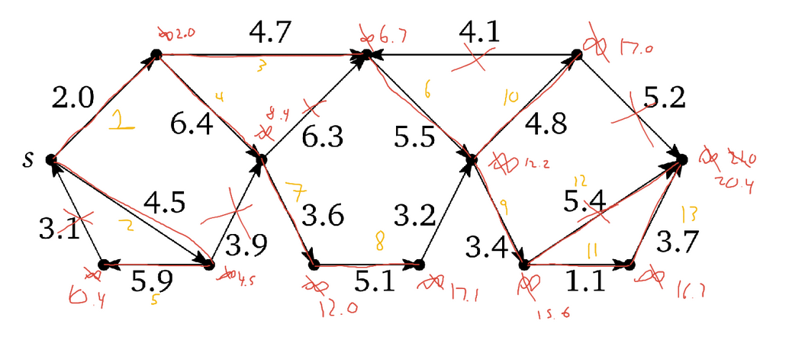

```{r setup, include=FALSE}
knitr::opts_chunk$set(echo = TRUE)
knitr::opts_chunk$set(comment = NA)
```

This page contains the content of all the slides for the material that we covered in Chapters 7,8,10, and 11 of [Algorithms](http://jeffe.cs.illinois.edu/teaching/algorithms/book/Algorithms-JeffE.pdf), by Jeff Erickson. If you notice any errors, please [create a new issue](https://github.com/djhunter/algorithms/issues).

# Trees

## Applications of Trees

- Binary search trees
- Recursion trees
- DFS and BFS trees
- Binary heaps
- Huffman Codes
- etc.

Most of these trees had a preferred *root*, and a preferred *direction* (away from the root).

## Tree: General Definition

> A **tree** is a connected, acyclic graph.

By default, a generic tree is *undirected*. To understand this definition, we need to be precise about the meaning of *acyclic*.

- A **walk** in an undirected graph $G$ is a sequence of vertices, where each
adjacent pair of vertices are adjacent in $G$.
- A walk is **closed** if it starts and ends at the same vertex. 
- A walk is called a **path** if it visits each vertex at most once.
- A **cycle** is a closed walk that enters and leaves each vertex at most once.
- An undirected graph is **acyclic** if no subgraph is a cycle.

## Unravel the definitions

1. Draw an example of a walk that is not a path.

2. Draw an example of a closed walk that is not a cycle.

3. What is a closed path? Can you draw an example?

4. Draw a tree with 6 vertices. How many edges does it have?

5. How many edges does a tree with $n$ vertices have? Can you prove your answer?

## Table Groups

```{r, echo=FALSE}
library(knitr)
roster <- c("Ethan", "Talia", "Drake", "Jack", "Andrew", "Blake", "Jordan", "Graham", "Kevin", "Logan", "Claire", "Bri", "Trevor", "James", "Kristen", "Levi", "Grace", "John", "Isaac", "Josiah", "Nathan")
set.seed(3122021) 
n <- length(roster)
ngps <- 7
maxingp <- ceiling(n/ngps)
# just make random groups
groups <- matrix(c(roster[sample(n)], 
                   rep("",(maxingp - (n %% maxingp)) %% maxingp)), 
                 ncol=maxingp, byrow=FALSE)
rownames(groups) <- paste0("Table #", 1:nrow(groups))
kable(t(groups))
```

# Paths in trees

## Unique Paths

**Lemma.** Suppose $T$ is a tree, and $u$ and $v$ are two vertices in $T$. Then there is a unique path from $u$ to $v$.

- There exists a path from $u$ to $v$ because $T$ is connected.
- Suppose to the contrary that there are two different paths from $u$ to $v$.
    - Path 1: $a_0 = u, a_1, a_2, \ldots, a_k = v$.
    - Path 2: $b_0 = u, b_1, b_2, \ldots, b_j = v$.
        - Let $a_s = b_s$ be the last vertex at the start of these paths that are the same.
        - Let $a_{k-e} = b_{j-e}$ be the first vertex at the end of these paths that are the same.
    - Then $a_s, \ldots, a_{k-e}, b_{j-e-1}, \ldots, b_s$ is a cycle, contradicting that $T$ is a tree.

## Equivalent Condition

The converse of the Lemma is also true: If $G$ is a graph with the property that every pair of vertices are joined by a unique path, then $G$ is a tree.

- Connected: $\checkmark$
- Acyclic: A cycle would contradict the unique path condition.

# Weighted Graphs

## Weighted Edges

A graph is called *weighted* if there is an assignment of real numbers (weights) to the edges.  For example,

- Cost function in a network.
- Distance function in a spatial arrangement.

## Minimum Spanning Tree of a Weighted Graph

Given a weighted graph $G$, a **minimum spanning tree** $T$ is a subgraph of $G$ such that:

- $T$ contains all the vertices of $G$, and
- The sum of weights of the edges of $T$ is as small as possible.

6.  Why do the above two conditions guarantee that $T$ is a tree?

7. Draw an example of a weighted graph with two different minimum spanning trees (if possible).

8. Draw an example of a weighted graph with a unique smallest edge $e$, such that the minimum spanning tree does not contain $e$ (if possible).

# Uniqueness

## Minimum spanning is unique (almost)

**Lemma.** If all edge weights in a connected graph $G$ are distinct, then $G$ has a unique minimum spanning tree.

- Suppose $G$ has two minimum spanning trees $T$ and $T'$.
- Let $e$ be the smallest edge in $(T\setminus T')\cup(T'\setminus T)$.
    - WLOG, $e\in T\setminus T'$.
- Adding this edge to $T'$ creates a cycle.
    - One of the edges in this cycle is not in $T$.
    - Exchange this edge for $e$, and you reduce the weight of $T'$, a contradiction.

# Minimum Spanning Trees

# Trees

## Tree: Definition and equvalent notions

A **tree** is a *connected*, *acyclic* graph. (By default, a generic tree is *undirected*.) Equivalently,

- *Unique paths:* A tree is an undirected graph $T$ such that, for any two vertices $u$ and $v$ in $T$, there is a unique path from $u$ to $v$.
- *$V-1$ edges:* A tree is a connected, undirected graph with $V-1$ edges.
    - *Can't add an edge:* Adding an edge to a tree makes a cycle.

## Minimum Spanning Tree of a Weighted Graph

- A graph is called *weighted* if there is an assignment of real numbers (weights) to the edges.  
- Given a weighted graph $G$, a **minimum spanning tree** $T$ is a subgraph of $G$ such that:
    - $T$ contains all the vertices of $G$, and
    - The sum of weights of the edges of $T$ is as small as possible.
- [Applications](https://en.wikipedia.org/wiki/Minimum_spanning_tree#Applications): network optimization, image recognition, data analysis, etc.

(See Jamboard from last time.)

## Table Groups

```{r, echo=FALSE}
library(knitr)
roster <- c("Ethan", "Talia", "Drake", "Jack", "Andrew", "Blake", "Jordan", "Graham", "Kevin", "Logan", "Claire", "Bri", "Trevor", "James", "Kristen", "Levi", "Grace", "John", "Isaac", "Josiah", "Nathan")
set.seed(3222021) 
n <- length(roster)
ngps <- 7
maxingp <- ceiling(n/ngps)
# just make random groups
groups <- matrix(c(roster[sample(n)], 
                   rep("",(maxingp - (n %% maxingp)) %% maxingp)), 
                 ncol=maxingp, byrow=FALSE)
rownames(groups) <- paste0("Table #", 1:nrow(groups))
kable(t(groups))
```

## Smallest edge

1. Let $G$ be a weighted graph with an edge $e$ that is lighter (i.e., smaller) than all the other edges. Prove that any minimum spanning tree must contain $e$.

Hints: 

- Suppose to the contrary that $T$ is a minimum spanning tree of $G$ and that ___________________.
- What happens if you add an edge to $T$?
- Show you can make a lighter spanning tree (contradiction).

# Uniqueness

## Simplifying assumption: distinct weights

Without losing generality, we can *assume our edge weights are distinct.*

Why is this OK?

- In most applications, they are distinct.
- We could break ties by adding an insignificant $\varepsilon$ to a weight.
- We could break ties some other systematic way.
- Two floats are "never" equal (at least you shouldn't expect them to be).

```{r}
sqrt(3)^2 == 3
```

## Two minimum spanning trees?

Suppose a connected, weighted, undirected graph $G$ has *distinct edge weights* and *two minimum spanning trees* $T$ and $T'$.

>- Suppose to the contrary that $T \neq T'$. 
>    - Then there are edges in $T$ that are not in $T'$, and edges in $T'$ that are not in $T$. Let $e$ be the smallest of these edges.
>    - In other words, $e$ is the smallest edge in $(T\setminus T')\cup(T'\setminus T)$. 
>    - WLOG, $e\in T\setminus T'$.
>- Adding this edge to $T'$ creates a cycle in $T'$.
>    - One of the edges in this cycle is not in $T$.
>    - Exchange this edge for $e$, and you reduce the weight of $T'$, a contradiction.

## **The** minimum spanning tree

We have proved the following.

**Lemma.** If all the edge weights of a graph are distinct, then its minimum spanning tree is *unique*.

So we will henceforth refer to "the" minimum spanning tree of a graph.

# Edge Classification

## Intermediate spanning forests

- We can build a spanning tree by selecting edges.
- At each stage, we avoid cycles, so we have a forest (maybe not a tree).

An *intermediate spanning forest* of a weighted graph $G$ is a subgraph of the minimum spanning tree of $G$.

## Safe and Useless edges

For any intermediate spanning forest $F$ of a graph $G$,

- An edge of $G$ is **useless** if it is not an edge of $F$, but both its endpoints are in the same component of $F$.
- An edge of $G$ is **safe** if it is the minimum-weight edge with exactly one endpoint in some component of $F$.

## Example

In the following graph $G$, the bold edges form an intermediate spanning forest $F$.

<center>

</center>

## Safe and Useless

2. Identify all the safe edges and all the useless edges.

3. What happens if you add a useless edge to $F$?

4. Add all the safe edges to $F$. Is the resulting forest $F'$ still an intermediate spanning forest?

5. Repeat: Add all of the safe edges of $F'$ to $F'$, and continue. How will this process terminate?

# Borůvka's MST Algorithm

# Assignment Comments, Sample Solutions

## MST with largest edge

1. Give an example of a weighted undirected graph that is not a tree, but whose minimum spanning tree contains the largest edge in the graph.

```
         1.1
       0--------0
   6.7/ \        \2.4
     /   \5.2     0
    0     \       /2.3
           0-----0
             3.3
```


## Largest cycle edge excluded

2. Let $G$ be a weighted, undirected graph. Prove that for any cycle in $G$, the minimum spanning tree *does not include* the largest edge in the cycle.

(Common wrong answer on Jamboard.)

## Proof considering components (sketch)

- Suppose there exists a minimum spanning tree $T$ that includes a maximum edge $e_\text{max} = uv$ of  some cycle. Remove $e_\text{max}$ from $T$. 

- The tree is no longer a minimum spanning tree but instead two components, one containing $u$ and the other containing $v$. But since there was a cycle in $G$ containing $e_{max}$, there is a path in $G$ from $u$ to $v$. Therefore, some edge $e$ on this path must connect the two components.

- Exchange $e$ and $e_\text{max}$, contradicting minimality.

## Disprove with a counterexample

3. Prove or disprove: The minimum spanning tree of a weighted, undirected graph $G$ includes the smallest edge in *every* cycle in $G$.

```
     (10)     (3)      (11)
e --------- a --- b ----------- d
 \           \   /             /
  \_      (2) \ / (1)        _/
    \          c            /
     \_                   _/
       \                 /
   (16) \_             _/ (15)
          \           /
           \_       _/
             \     /
              \_ _/
                f
```

# Safe and Useless

## Minimum Spanning Tree of a Weighted Graph

- Given a weighted graph $G$, a **minimum spanning tree** $T$ is a subgraph of $G$ such that:
    - $T$ contains all the vertices of $G$, and
    - The sum of weights of the edges of $T$ is as small as possible.
- An *intermediate spanning forest* is a subgraph of the MST.

For any intermediate spanning forest $F$ of a graph $G$,

- An edge of $G$ is **useless** if it is not an edge of $F$, but both its endpoints are in the same component of $F$.
- An edge of $G$ is **safe** if, in some component of $F$, it is the minimum-weight edge with exactly one endpoint in the component.

## Prim's Theorem

**Theorem.** Let $F$ be an intermediate spanning forest of a weighted graph $G$, and suppose $e$ is a safe edge. Then the minimum spanning tree contains $e$.

>- Let $C$ be the component of $F$ that $e$ is "safe" for, so $e$ has an endpoint in $C$ and an endpoint in $G \setminus C$, and $e$ is the smallest such edge.
>- Suppose to the contrary that the minimum spanning tree $T$ does not contain $e$. The endpoints $u$ and $v$ of $e$ must be connected by a path in $T$, and since exactly one of the endpoints of $e$ is in $C$, one of the edges $e'$ of this path must have an endpoint in $C$ and an endpoint not in $C$. 
>- Removing $e'$ from $T$ creates a spanning forest with two components, one containing $u$ and another containing $v$. Adding $e$ to this forest connects these components, and so creates a tree. But this new tree has smaller total weight than $T$, because $e$ is smaller than $e'$. That's a contradiction.

## Greedy MST Meta-Algorithm

Let $G$ be a weighted graph with vertex set $V$ and edge set $E$.

```{javascript, eval=FALSE}
MetaMST(V,E)
    F = (V, ∅)
    while F is not a tree
        add a safe edge to F   // NOTE: This choice needs to be specified!!
    return F
```

(See Jamboard from last time.)

# Borůvka's Algorithm for the minimum spanning tree

## General idea

Use `MetaMST`, but add *all* the safe edges inside the `while`-loop.

```{javascript, eval=FALSE}
MetaMST(V,E)
    F = (V, ∅)
    while F is not a tree
        add a safe edge to F   // NOTE: This choice needs to be specified!!
    return F
```

In order to analyze the time, we need to specify how the safe edges are located.

## Table Groups

```{r, echo=FALSE}
library(knitr)
roster <- c("Ethan", "Talia", "Drake", "Jack", "Andrew", "Blake", "Jordan", "Graham", "Kevin", "Logan", "Claire", "Bri", "Trevor", "James", "Kristen", "Levi", "Grace", "John", "Isaac", "Josiah", "Nathan")
set.seed(3242021) 
n <- length(roster)
ngps <- 7
maxingp <- ceiling(n/ngps)
# just make random groups
groups <- matrix(c(roster[sample(n)], 
                   rep("",(maxingp - (n %% maxingp)) %% maxingp)), 
                 ncol=maxingp, byrow=FALSE)
rownames(groups) <- paste0("Table #", 1:nrow(groups))
kable(t(groups))
```

## Label the vertices with their component number

```{javascript, eval=FALSE}
CountAndLabel(G):                         LabelOneComponent(s,count):
    count <- 0                                Enqueue(s)
    for all vertices v                        while the queue is not empty
        unmark v                                  v <- Dequeue
    for all vertices v                            if v is unmarked
        if v is unmarked                              mark v               // Line #1
            count <- count + 1                        v.comp <- count
            LabelOneComponent(v, count)               for each edge vw 
    return count                                          Enqueue(w)       // Line #2
```

Suppose $G$ has $V$ vertices and $E$ edges.

1. What is another name for the `LabelOneComponent` algorithm?

2. How many times does `CountAndLabel` execute Line #1?

3. How many times does `CountAndLabel` execute Line #2?

4. What is the running time of `CountAndLabel`?

## Borůvka's Algorithm

```{javascript, eval=FALSE}
Borůvka(V, E):                              AddAllSafeEdges(E, F, count):
    F = (V, ∅)                                  for i <- 1 to count
    count <- CountAndLabel(F)                       safe[i] <- Null
    while count > 1                             for each edge uv ∈ E
        AddAllSafeEdges(E, F, count)                if comp(u) != comp(v)
        count <- CountAndLabel(F)                       if safe[comp(u)] = Null or w(uv) < w(safe[comp(u)])
    return F                                                safe[comp(u)] <- uv
                                                        if safe[comp(v)] = Null or w(uv) < w(safe[comp(v)])
                                                            safe[comp(v)] <- uv
                                                for i <- 1 to count
                                                    add safe[i] to F   
```

## Borůvka's Algorithm

```{javascript, eval=FALSE}
Borůvka(V, E):                              AddAllSafeEdges(E, F, count):
    F = (V, ∅)                                  for i <- 1 to count
    count <- CountAndLabel(F)                       safe[i] <- Null
    while count > 1                             for each edge uv ∈ E
        AddAllSafeEdges(E, F, count)                if comp(u) != comp(v)
        count <- CountAndLabel(F)                       if safe[comp(u)] = Null or w(uv) < w(safe[comp(u)])
    return F                                                safe[comp(u)] <- uv
                                                        if safe[comp(v)] = Null or w(uv) < w(safe[comp(v)])
                                                            safe[comp(v)] <- uv
                                                for i <- 1 to count
                                                    add safe[i] to F   
```

5. What is the running time of the *first* `CountAndLabel` call?

6. After the *first* `AddAllSafeEdges` call, how many components (at most) are there? (i.e., what is the maximum possible value of `count`?)

7. What is the worst-case number of iterations of the `while`-loop?

8. What is the running time of subsequent `CountAndLabel` calls?

9. Give an upper bound on the running time of `AddAllSafeEdges`.


## Bonus Reading

Read pp. 262-263. *Upshot:* Borůvka's Algorithm often beats its worst-case $O(E \log V)$ running time.

# Classical MST Algorithms

# Announcement: CS Candidate

## Invitation for Feedback

Dr. Wonjun Lee will be interviewing next week for our open CS professor position.

- **Colloquium:** MG Tent #1: 3:30-5pm, Tuesday, March 30 (location tentative).
- **Teaching Demo:** Monday, March 29, 9:10-10:15: https://youtu.be/IFvpuv5k_ZU

I have to attend the Teaching Demo, so **class is cancelled for Monday, 3/29.** (Also office hours will end early on Tuesday.)

- Please consider **attending Tuesday's colloquium** as a substitute.

# Assignment Comments, Sample Solutions

## One pass: High level description

(See Jamboard)

- Mark the edges to contract (find min, should be $O(E)$).
- For each marked edge $uv$:
    - Make a new vertex/linked list $n$
    - Add all of $u$'s neighbors to $n$, and weight them appropriately.
    - Add all of $v$'s neighbors to $n$, and weight them. (avoiding duplicates somehow)
    - Add $n$ to the linked lists of the vertices in $n$'s list.
    - Remove $u$ and $v$'s lists.

Need to add some details to this to specify completely. $O(V+E)$?

## Partial solution? Could we speed it up?

```
Boruvka(G) {
  initalize set edges_to_collapse
  
  for each vertex v in G {
      min_edge = null
      min_weight = infinity
      for each edge uv according to the adjacency list {
          if uv.weight < min_weight {
              min_edge = uv
              min_weight = uv.weight
          }
      }
      add min_edge to edges_to_collapse
  }
  
  for each edge uv in edges_to_collapse {
      add new node x to adjacency list
      for each neighbor n of u
        add n to x's linked list
        change "u" in n's linked list to "x"
      for each neighbor n of v
        if n is already in x's linked list
          if nv.weight > nu.weight
            nx.weight = nv.weight
        else
          add n to x's linked list
          change "v" in n's linked list to "x"
      remove u and v nodes from adjacency list
  }
}
```

## Another nice try

```
BoruvkaContraction(A[1..V]):
  //iterate over all edges and mark those to be contracted
  for i <- 1..V:
    edges <- A[i] //has indices 1..n
    min <- (edge with weight of infinity)
    for j <- 1..n:
      if edges[j].weight < min.weight:
        min <- the edge from i to edges[j]
    mark the edge min
  for i <- 1..V:
    if A[i] contains a marked edge uv:
      //add v's out-edges to u
      new <- A[u]
      old <- A[v]
      for j <- 1..n:
        if old[j] is not in new:
          add old to A[u] // new
        else: //only add smallest parallel edge
          parallel <- from new to old[j]
          if old[j].weight < parallel.weight:
            delete parallel from A[u] // new
            add A[v][j] to A[u]
        replace v in A[old[j]] with u
      delete old
```

# Classical MST Algorithms

## Prim's Theorem; Meta-algorithm

**Theorem.** Let $F$ be an intermediate spanning forest of a weighted graph $G$, and suppose $e$ is a safe edge. Then the minimum spanning tree contains $e$.

```{javascript, eval=FALSE}
MetaMST(V,E)
    F = (V, ∅)
    while F is not a tree
        add a safe edge to F   // NOTE: This choice needs to be specified!!
    return F
```

## Jarník's Algorithm (aka Prim's algorithm)

- Start with any vertex $T$.
- Add $T$'s safe edge to $T$.
    - Repeat until you run out of vertices.
    
Exercise: Describe this completely, and verify its running time.


## Kruskal's Algorithm

- Start with the forest $F$ of vertices.
- Scan all edges by increasing weight; if an edge is safe, add it to $F$.

```
Kruskal(V, E):
    sort E by increasing weight (e.g., MergeSort)
    F <- (V, ∅)
    for each vertex v ∈ V
        MakeSet(v) // Set data structure partitioning V
    for i <- 1 to |E|
        uv <- ith lightest edge in E
        if Find(u) != Find(v) // Are u and v in different partitions?
            Union(u, v)
            add uv to F
    return F
```

- Need $O(E \log E)$ to sort, and that's the most expensive step. 
- In general, $E$ is going to be bigger than $V$ for connected graphs, but at most $E = O(V^2)$. So $\Theta(\log E) = \Theta(\log V)$.
- So the time is $O(E \log V)$ (which is the same as $O(E \log E)$, in this case).

## Table Groups

```{r, echo=FALSE}
library(knitr)
roster <- c("Ethan", "Talia", "Drake", "Jack", "Andrew", "Blake", "Jordan", "Graham", "Kevin", "Logan", "Claire", "Bri", "Trevor", "James", "Kristen", "Levi", "Grace", "John", "Isaac", "Josiah", "Nathan")
set.seed(3262021) 
n <- length(roster)
ngps <- 7
maxingp <- ceiling(n/ngps)
# just make random groups
groups <- matrix(c(roster[sample(n)], 
                   rep("",(maxingp - (n %% maxingp)) %% maxingp)), 
                 ncol=maxingp, byrow=FALSE)
rownames(groups) <- paste0("Table #", 1:nrow(groups))
kable(t(groups))
```

## Step through Jarník and Kruskal

1. On the Jamboard, step through Jarník's algorithm on the given graph. Label the edges in the order they get added. Start at the vertex at the top.

2. On the Jamboard, step through Kruskal's algorithm on the given graph. Label the edges in the order they get added. 

# Adjacency Matrices

## Recall: Adjacency Matrix

Weighted graphs can be represented with $V \times V$ *matrix*:

$$
\begin{bmatrix}
a_{1,1} & a_{1,2} & \cdots & a_{1,V} \\
a_{2,1} & a_{2,2} & \cdots & a_{2,V} \\
\vdots & \vdots && \vdots \\
a_{V,1} & a_{V,2} & \cdots & a_{V,V} 
\end{bmatrix}
$$

- $a_{i,j} = w$ if there is an edge from vertex $i$ to vertex $j$ of weight $w$.
- $a_{i,j} = 0$ if there isn't an edge.
- More efficient for *dense* graphs (lots of edges). Less efficient for *sparse* graphs.

## Compute the adjacency matrix

3. Compute the adjacency matrix for the graph given on the Jamboard.


# Single Source Shortest Path Algorithms

# Assignment Comments

## Jarník Example

Order of addition: KH KJ JI IF FC FG FE GD DB DA


## Jarník Description and Time

Use a priority queue that does `DecreaseKey`, `Insert`, and `ExtractMin` each in $O(\log V)$ time.

```
Jarník(G):
  pick random vertex v
  T <- graph containing just v
  Insert all neighboring edges into priority queue (key = weight)
  while the priority queue is not empty:
    ExtractMin edge uv
    if uv is unmarked and u and v are not both in T:
      mark uv
      add uv to T
      for each unmarked edge neighboring u and v
        Insert edge (key = weight)
```

- Each edge gets marked once, so there are $O(E)$ `ExtractMin` and `Insert`'s.
- Time $O(E \log E)$.
- Recall that $O(E \log E) = O(E \log V)$ since $E \in O(V^2)$.

## Another Jarník Description

```
JarnikTree(G, start_vertex):
  tree = Tree()
  active_edges = PriorityQueue()
  add G[start_vertex].edges to active_edges (sorted by edge weight)
  while tree.node_count != G.node_count:
    safe = pop from active_edges
    if G[safe] in tree: continue
    add G[safe] to tree
    add G[safe].edges to active_edges (sorted by edge weight)
  return tree
```

- See also Figure 7.5 (and just use a binary heap)

## Adjacency Matrix Example

```
    A   B   C   D   E   F   G   H   I   J   K 
A   0   7   0  3.2  0   0   0   0   0   0   0
B   7   0  8.9  3   0   0   0   0   0   0   0
C   0  8.9  0   9   6   2   0   0   0   0   0
D  3.2  3   9   0   0   5  4.1  0   0   0   0
E   0   0   6   0   0   4   0  5.7  0   0   0 
F   0   0   2   5   4   0  2.6  0  3.7  0   0
G   0   0   0  4.1  0  2.6  0   0   0  7.5  0
H   0   0   0   0  5.7  0   0   0   8   0  4.7
I   0   0   0   0   0  3.7  0   8   0   1  6.2
J   0   0   0   0   0   0  7.5  0   1   0  5.3
K   0   0   0   0   0   0   0  4.7 6.2 5.3  0
```

## Adjacency Matrix Jarník description/time

```
// s is starting vertex
// M is adjancency matrix
Jarnik(M[V,V],s):
  T <-({s},∅)
  neighbors <- []
  neighbors.add(s)
  while neighbors is not empty
    for each e ∈ neighbors
      min <- infinity
        for i <- 1 to |V|
          if M[e,i] != 0 and M[e,i] < min
            min <- M[e,i]
            newNeighbor <- i
        add newNeighbor to T
    neighbors.add(newNeighbor)
  return T
```

Time: $O(V^3)$


# Shortest Paths

## Shortest Paths, SSSP

- Now we consider **directed**, **weighted** graphs with *positive* weights.
- The natural problem is how to get from one vertex to another following the directed path of least weight.
    - e.g., transportation optimization, network routing, LaTeX line breaking, Rubik's Cube, etc.
- Finding the shortest path from $s$ to $f$ usually means we have to find the shortest path from $s$ to everything.
    - Find the **SSSP Tree.**
        - Similar to Breadth-First spanning tree, but with weights.

## Tentative Shortest Paths and Predecessors

- $s$ is the start vertex.
- $s \rightsquigarrow v$ is the **tentative shortest path** from $s$ to $v$.
- $\text{dist}(v)$ is the **weight** of the tentative shortest path $s \rightsquigarrow v$.
- $\text{pred}(v)$ is the **predecessor** of $v$ in $s \rightsquigarrow v$.

We find the shortest path by updating the tentative shortest paths until we can't make them any better.

## Tense edges

- $\text{dist}(v)$ is the *weight* of the tentative shortest path $s \rightsquigarrow v$.
- $\text{pred}(v)$ is the *predecessor* of $v$ in $s \rightsquigarrow v$.

An edge $u\rightarrow v$ is called **tense** if $\text{dist}(u) + w(u\rightarrow v) < \text{dist}(v)$.

- So we can improve things by going through $u\rightarrow v$. (**relax**ing)
- That is, replace the tentative $s \rightsquigarrow v$ with $s \rightsquigarrow u \rightarrow v$, and update $\text{dist}(v)$ and $\text{pred}(v)$.

## SSSP by Repeated Relaxing: Meta-Algorithm

```
InitSSSP(s):                          Relax(uv):
    dist(s) <- 0                          dist(v) <- dist(u) + w(uv)
    pred(s) <- Null                       pred(v) <- u
    for all vertices v != s
        dist(v) <- Infinity
        pred(v) ← Null
        
MetaSSSP(s):
    InitSSSP(s)
    while there is at least one tense edge      // NOTE: need to specify how to check
        Relax any tense edge                    // NOTE: need to specify how to choose
```


## Table Groups

```{r, echo=FALSE}
library(knitr)
roster <- c("Ethan", "Talia", "Drake", "Jack", "Andrew", "Blake", "Jordan", "Graham", "Kevin", "Logan", "Claire", "Bri", "Trevor", "James", "Kristen", "Levi", "Grace", "John", "Isaac", "Josiah", "Nathan")
set.seed(3302021) 
n <- length(roster)
ngps <- 7
maxingp <- ceiling(n/ngps)
# just make random groups
groups <- matrix(c(roster[sample(n)], 
                   rep("",(maxingp - (n %% maxingp)) %% maxingp)), 
                 ncol=maxingp, byrow=FALSE)
rownames(groups) <- paste0("Table #", 1:nrow(groups))
kable(t(groups))
```

## Find the SSSP Tree: Jamboard

Starting at the leftmost vertex $s$, apply repeated `Relax`ings to produce the SSSP tree for the given graph. Make note of a relaxing that you do where none of the distances are $\infty$.

# Variations

## Dijkstra's Algorithm

Use a priority queue that does `DecreaseKey`, `Insert`, and `ExtractMin` each in $O(V)$ time.

- The vertices go in the priority queue.
- The key for vertex $v$ is $\text{dist}(v)$.
- Starting with $s$, process the smallest edge and loop.

```
DijkstraSSSP(s):
    InitSSSP(s)
    for all vertices v
        Insert(v, dist(v))
    while the priority queue is not empty
        u <- ExtractMin()
        for all edges uv
            if uv is tense
                Relax(uv)
                DecreaseKey(v, dist(v))
```

(See Figure 8.12)

## Jamboard

Step through `DijkstraSSSP` on the Jamboard. Keep track of each `Relax` call (which edge gets relaxed, and in which order). 

## Dijkstra running time

```
DijkstraSSSP(s):
    InitSSSP(s)
    for all vertices v
        Insert(v, dist(v))
    while the priority queue is not empty
        u <- ExtractMin()
        for all edges uv
            if uv is tense
                Relax(uv)
                DecreaseKey(v, dist(v))
```

- `DecreaseKey`, `Insert`, and `ExtractMin` are all $O(\log V)$.
- At most $E$ `DecreaseKey`, at most $V$ `Insert`, and `ExtractMin`.
- Graphs are connected, so $E$ is "bigger" than $V$.
- Total time: $O(E \log V)$

## Bellman-Ford

- Relax *all* the tense edges, and recurse.
- Use an array `dist[]` to store the distances for each vertex.

```
BellmanFordSSSP(s)
    dist[s] <- 0
    for every vertex v != s
        dist[v] <- Infinity
    for i <- 1 to V − 1
        for every edge uv
            if dist[v] > dist[u] + w(uv)
                dist[v] <- dist[u] + w(uv)
```

Time: $O(VE)$

# SSSP Trees, continued

# Assignment Comments

## Single Source Shortest Path

```
InitSSSP(s):                          Relax(uv):
    dist(s) <- 0                          dist(v) <- dist(u) + w(uv)
    pred(s) <- Null                       pred(v) <- u
    for all vertices v != s
        dist(v) <- Infinity
        pred(v) ← Null
        
MetaSSSP(s):
    InitSSSP(s)
    while there is at least one tense edge      // NOTE: need to specify how to check
        Relax any tense edge                    // NOTE: need to specify how to choose
```

## Dijkstra's Algorithm

```
DijkstraSSSP(s):
    InitSSSP(s)
    for all vertices v
        Insert(v, dist(v))
    while the priority queue is not empty
        u <- ExtractMin()
        for all edges uv
            if uv is tense
                Relax(uv)
                DecreaseKey(v, dist(v))
```

## Step Through Dijkstra's Algorithm

Relaxation order: 2.0, 4.5, 4.7, 6.4, 5.9, 5.5, 3.6, 5.1, 3.4, 4.8, 1.1, 5.4, 3.7



## Looped Trees

- Every leaf has an edge back to the root.
- Otherwise, $G$ is a binary tree with $n$ vertices and $n-1$ edges.
    - There are about $n/2 = \Theta(n)$ leaves.
    - So there are $n-1 + \Theta(n) = O(n)$ edges in the looped tree.
- Dijkstra Time: $O(E \log V) = O(n \log n)$.

## Faster shortest path algorithm

- If $u$ is above $v$, then BFS (starting at $u$) will find the (only) path in $O(n)$ time.
- If $v$ is above $u$, the the shortest path will be the shortest path from $u$ to the root, followed by the only path from the root to $v$.
    - Consider the reversal graph ($O(n)$). 
    - BFS, starting at root. Mark each node with a `distanceFromRoot` attribute.
        - If new distance is less than marked distance, update, and update parents. 
        - $O(n)$, because each node is only ever going to be marked twice.
    


# Shortest Paths

## Tentative Shortest Paths and Predecessors

- $s$ is the start vertex.
- $s \rightsquigarrow v$ is the **tentative shortest path** from $s$ to $v$.
- $\text{dist}(v)$ is the **weight** of the tentative shortest path $s \rightsquigarrow v$.
- $\text{pred}(v)$ is the **predecessor** of $v$ in $s \rightsquigarrow v$.
- $\text{dist}(v)$ is the *weight* of the tentative shortest path $s \rightsquigarrow v$.
- $\text{pred}(v)$ is the *predecessor* of $v$ in $s \rightsquigarrow v$.

An edge $u\rightarrow v$ is called **tense** if $\text{dist}(u) + w(u\rightarrow v) < \text{dist}(v)$.

## SSSP by Repeated Relaxing: Meta-Algorithm

```
InitSSSP(s):                          Relax(uv):
    dist(s) <- 0                          dist(v) <- dist(u) + w(uv)
    pred(s) <- Null                       pred(v) <- u
    for all vertices v != s
        dist(v) <- Infinity
        pred(v) ← Null
        
MetaSSSP(s):
    InitSSSP(s)
    while there is at least one tense edge      // NOTE: need to specify how to check
        Relax any tense edge                    // NOTE: need to specify how to choose
```

- `pred(v)` and `dist(v)` get updated as the algorithm `metaSSSP` runs.
    - So edges that were tense become not tense.
- **Correctness:** We need to prove that, if there are no tense edges, then the *tentative shortest path* $s \rightarrow \cdots \rightarrow \text{pred}(\text{pred}(v)) \rightarrow \text{pred}(v) \rightarrow v$ is in fact a shortest path from $s$ to $v$.


## Table Groups

```{r, echo=FALSE}
library(knitr)
roster <- c("Ethan", "Talia", "Drake", "Jack", "Andrew", "Blake", "Jordan", "Graham", "Kevin", "Logan", "Claire", "Bri", "Trevor", "James", "Kristen", "Levi", "Grace", "John", "Isaac", "Josiah", "Nathan")
set.seed(462021) 
n <- length(roster)
ngps <- 7
maxingp <- ceiling(n/ngps)
# just make random groups
groups <- matrix(c(roster[sample(n)], 
                   rep("",(maxingp - (n %% maxingp)) %% maxingp)), 
                 ncol=maxingp, byrow=FALSE)
rownames(groups) <- paste0("Table #", 1:nrow(groups))
kable(t(groups))
```

## Predecessor paths

1. Suppose that $s = \text{pred}(v) = \text{pred}(u)$, but the path $s \rightarrow v$ is longer than the path $s \rightarrow u \rightarrow v$. Which edge is tense?

2. Suppose that $s \rightarrow \cdots \rightarrow \text{pred}(\text{pred}(v)) \rightarrow \text{pred}(v) \rightarrow v$ is not a shortest path from $s$ to $v$. That is, suppose there is a shorter path $s \rightarrow u_1 \rightarrow u_2 \rightarrow \cdots \rightarrow u_k \rightarrow v$.
    a. Explain why you can relax the edges in order $su_1, u_1u2, \ldots, u_{k-1}u_k$.
    b. Once you have done that, which edge is tense?

# Shortest paths in DAGs

## Recall: DAGs

- A directed graph *without cycles* is called a **directed acyclic graph** (DAG).
- A *topological ordering* of $G$ is an ordering $\prec$ of the vertices such that $u \prec v$ for every edge $u \rightarrow v$.
- In other words, it is a listing of the vertices that respects the arrows.

```
TopologicalSort(G):
    Call DFSAll(G) to compute finishing times v.post for all v in G
    Return vertices in order of decreasing finishing times
```

So we can topologically sort the vertices in $O(V+E)$ time.

## Shortest Paths in DAGs

Recursive Structure: Compute the length of the shortest path from $s$ to $v$.

```
LengthSP(v):
    if v = s
        return 0
    else
        minLength <- Infinity
        for all edges uv
            tryLength <- LengthSP(u) + w(uv)
            if tryLength < minLength
                minLength <- tryLength
```

- If your graph has a cycle, this might never finish.
- If your graph is a DAG, it will.

## Dynamic Programming

- Let `v[1..n]` be the vertex set in topological order. (`s = v[1]`)
- Memoize: Let `LSP[1..n]` be the length of the shortest path.
- Evaluation order: `LSP[v]` depends on `LSP[u]` for $u \prec v$.

```
DagSSSP(s):
    for all vertices v in topological order
        if v = s
            LSP(v) <- 0
        else
            LSP(v) <- Infinity
            for all edges uv
                if LSP(v) > LSP(u) + w(uv)
                    LSP(v) <- LSP(u) + w(uv)
                    pred(v) <- u
```

Secretly, `LSP[i]` is the same as `dist(v[i])`. See Figure 8.9.

## `DagSSSP` time

```
DagSSSP(s):
    for all vertices v in topological order   // O(V + E)
        if v = s
            LSP(v) <- 0
        else
            LSP(v) <- Infinity
            for all edges uv                  // need rev(G) to do this
                if LSP(v) > LSP(u) + w(uv)   
                    LSP(v) <- LSP(u) + w(uv)
                    pred(v) <- u
```

- Recall `rev(G)` can be computed in $O(V+E)$ time.
- Constant time work on each edge.

Total Time: $O(V+E)$

# Flow Networks

# Assignment Comments

## Negative cycles

```{r, echo=FALSE, message=FALSE}
library(igraph)

G <- list(c(2), 
          c(3,4), 
          c(1), 
          c())
M <- graph_from_adj_list(G, mode="out") 
oldPar <- par(mar=c(0.1,0.1,0.1,0.1)) # reduce the margins
set.seed(1234) # fix the randomization of the following plot command
nod <- data.frame(wt = c(1,-100,4,2))
plot(M, vertex.color= c("blue","yellow","red","green"), edge.label = nod$wt)
```

## What if `pred(s)` ever changes?

If `pred(s)` changes after `InitSSSP`, it would signify that the algorithm had taken a path through the input graph already that had led it back to `s`, meaning that there was some path `s -> u-> u_1 ... -> u_k -> s`, and the edge `u_k -> s` would have to be tense. This would mean that the cycle was negative, since `s` starts with a distance of zero. Thus, the input graph contains a negative cycle that travels back through `s`.

## Logic review

- **Converses:** $P \Rightarrow Q$ is not the same statement as $Q \Rightarrow P$.
- **Contrapositives:** $P \Rightarrow Q$ is logically equivalent to $\neg Q \Rightarrow \neg P$.
    - Sometimes it is easier to *prove the contrapositive* of the statement you are trying to prove.

## Necessary condition for no negative cycles

Prove that, if the input graph has no negative cycles, then $P \cup X$ is always a dag. 

- Suppose $P \cup X$ is not a dag at some point, so it contains a cycle. 
    - We can assume that the first time this happens, $P$ does not contain the cycle.
- This means that adding tense edges to $P$ would result in a cycle.
- But the only way these edges could be tense would be if they improved the distance on some node, which would mean the input graph has a negative cycle.

## Sufficient condition for no negative cycles

Prove that, if $P \cup X$ is always a dag, then the input graph has no negative cycles.

- Suppose that the input graph has a negative cycle.
- Apply `MetaSSSP`, and start by relaxing edges to form a path to this negative cycle from $s$.
- Then relax the edges in this cycle. Since it is a negative cycle, you will encounter a vertex again through a tense edge. So at this point, $P \cup X$ is not a dag.


# Flow Networks

## Flow in a directed graph

- There is a start vertex $s$ and a terminal vertex $t$.
- Every vertex is reachable from $s$, and $t$ is reachable from every vertex.
    - There are paths $s \rightsquigarrow v \rightsquigarrow t$ for all $v$.
- Each edge has a *capacity* measuring how much flow it can carry.
- The total flow *into* a vertex must equal the total flow *out*.
    - Analogies: Water pipes, Freeways
- **Maximum flow problem:** Given a flow network, find the maximum flow from $s$ to $t$.

**Applications:** Optimizing transportation, scheduling, distributed systems, image processing, baseball elimination, etc.

## Flows: Definitions

Let $G$ be a directed graph where each edge $e$ has capacity $c(e)$.

- An *$(s,t)$-flow* is an assignment of values $f(e)$ to each edge $e$ of $G$ such that the total flow into each vertex $v$ equals the total flow out (except, possibly, at $s$ and $t$).

$$
\sum_a f(a\rightarrow v) = \sum_z f(v \rightarrow z)
$$
- The *value* $|f|$ of a flow $f$ is the total net flow out of $s$ (or equivalently, into $t$.)

$$
|f| = \sum_z f(s \rightarrow z) - \sum_a f(a \rightarrow s)
$$

- A flow is *feasible* if it obeys the capacity limits on each edge $e$: $0 \leq f(e) \leq c(e)$. See Figure 10.2.


## Table Groups

```{r, echo=FALSE}
library(knitr)
roster <- c("Ethan", "Talia", "Drake", "Jack", "Andrew", "Blake", "Jordan", "Graham", "Kevin", "Logan", "Claire", "Bri", "Trevor", "James", "Kristen", "Levi", "Grace", "John", "Isaac", "Josiah", "Nathan")
set.seed(492021) 
n <- length(roster)
ngps <- 7
maxingp <- ceiling(n/ngps)
# just make random groups
groups <- matrix(c(roster[sample(n)], 
                   rep("",(maxingp - (n %% maxingp)) %% maxingp)), 
                 ncol=maxingp, byrow=FALSE)
rownames(groups) <- paste0("Table #", 1:nrow(groups))
kable(t(groups))
```

## Improve the flow?

Can you increase the flow in Figure 10.2, keeping it feasible? If so, try to make its value as big as possible.

# Cuts

## Cuts: Definitions

Let $G$ be a directed graph where each edge $e$ has capacity $c(e)$.

- An *$(s,t)$-cut* is a partition of the vertices into two sets $S$ and $T$, such that $s\in S$ and $t\in T$.
- The *capacity* $\lVert S, T \rVert$ of a cut $S,T$ is the sum of the capacities of the edges that go from $S$ to $T$.
    - Cutting these edges would eliminate the flow from $s$ to $t$.
    - See Figure 10.2.
    
## Find a cut

1. Find a cut in the graph in Figure 10.2, and try to make its capacity as small as possible.

2. Try to find a flow whose value is bigger than the capacity of the cut that you found.

## Flows can't exceed cuts

**Lemma.** The value of any feasible $(s,t)$-flow is less than or equal to the capacity of any $(S,T)$-cut.

*Proof.*

>- The value of the flow is the net flow out of $s$.
>- The net flow out of $s$ is the sum of the net flows through all the vertices in $S$ (since all the others have a net of zero).
>- This remains true if we remove the edges that go from $S$ to $S$ (zero sum).
>- The only edges left go from $S$ to $T$. 
>    - So the total flow from $S$ to $T$ can't be more than the capacity.
>    - The max happens when all the edges across are *saturated*, and all the edges back are *avoided*.

## Maxflow-Mincut Theorem

>- **Lemma.** The value of any feasible $(s,t)$-flow is less than or equal to the capacity of any $(S,T)$-cut.
>- **Corollary.** If you can find a cut and a flow such that the capacity of the cut equals the value of the flow, you have found a maximum flow.
>- **Theorem.** You *can* always find such a cut and flow.
>    - (Proof next week.)

# The Maxflow-Mincut Theorem

# Assignment Comments

## Maximum flow = minimum cut

- See Jamboard. More than one cut: minimum capacity = 14.
- *Note:* Across the cut, in the max flow, all edges are *saturated* (to capacity) and all returning edges are *avoided* (zero).

## Hostile Dogs

- Take the directed graph representing their neighborhood (with each street being an edge and each intersection being a vertex) and assigning a capacity of 1 to every street. 
    - Ensures that only one dog can use that street.
    - Direct the edges toward the vet.
- You would need a flow of at least 2. 
    - 2 dogs would leave s and 2 dogs would enter t.
    
>- *Note:* a minimum cut of 1 would be a street both dogs were forced to walk on.
    
# Maxflow-Mincut Theorem Proof/Algorithm

## Maxflow-Mincut Theorem

- **Lemma.** The value of any feasible $(s,t)$-flow is less than or equal to the capacity of any $(S,T)$-cut.
- **Corollary.** If you can find a cut and a flow such that the capacity of the cut equals the value of the flow, you have found a maximum flow.
    - In this situation, all the edges from $S$ to $T$ will be saturated, and all the edges from $T$ to $S$ will be avoided.
- **Theorem.** You *can* always find such a cut and flow.

**Maxflow-Mincut Theorem.** In every flow network with source $s$ and
target $t$, the value of the maximum $(s,t)$-flow is equal to the capacity of the minimum $(s,t)$-cut.

*Proof.* Ford-Fulkerson Algorithm

## Residual Graph

Given a flow network $G$ and a flow $f$, the **residual graph** $G_f$ is the graph with the same vertex set as $G$, but whose edges indicate how much $f$ could be increased/decreased on each edge of $G$.

- If $u\rightarrow v$ in $G$ has spare capacity $x$, then $u\rightarrow v$ has capacity $x$ in $G_f$.
- If $u \rightarrow v$ in $G$ has flow value $y$, then the *reverse* edge $v \rightarrow u$ in $G_f$ has capacity $y$.

See Figure 10.5.

## Group exercise

Draw the residual graph for the given graph. (See Jamboard)

## Augmenting paths

Now suppose $G_f$ has a path from $s$ to $t$.

- Let $F$ be the capacity of the smallest edge in this path.
    - So this path can handle a flow of $F$.
- Now **augment** the flow $f$ in $G$:
    - Add $F$ to edge $u \rightarrow v$ if $u\rightarrow v$ is in the augmenting path.
    - Subtract $F$ from edge $u \rightarrow v$ if the reverse $v \rightarrow u$ is in the augmenting path.

See Figure 10.5 again.

## Flow stays feasible when augmented

- Since $F$ is the *smallest* common increment/decrement, the capacity limits are still obeyed.
- Since the augmenting path is itself a flow, the conservation property is still satisfied at each vertex.
    - Details in book.

## No augmenting path? That's a min cut!

Suppose there is no path from $s$ to $t$ in $G_f$.

- Let $S$ be the vertices reachable from $s$ in $G_f$, and let $T$ be the complement.
- There is no edge from $S$ to $T$ in $G_f$.
    - So every edge from $S$ to $T$ in $G$ is saturated.
    - And every edge from $T$ to $S$ in $G$ is avoided.
    
That means we've found a cut with the same capacity as the value of the flow.

>- This proves the theorem! (You *can* always find a matching cut/flow).
>- This gives us the algorithm too.

## Group exercise

- Find an augmenting path on your residual graph.
- Augment the flow.
- Update the residual graph.

Repeat until no path from $s$ to $t$ exists.

# The Ford-Fulkerson Algorithm

## Ford-Fulkerson Method/Algorithm

Start with a zero flow and construct the residual graph $G_f$. Repeat the following until there's no path from $s$ to $t$ in $G_f$.

- Find an augmenting path in the residual graph.
- Augment the flow.
- Update the residual graph.

## Ford-Fulkerson Time?

Each iteration is linear time: $O(E)$ since the graph is connected.

- *Assume* capacities are integers. 
    - So $f$ and $F$ will always be integers.
- Let $|f^*|$ be the value of the maximum flow.
    - Each iteration increases the flow by $F$, which is at least 1.
    - So there could only be $|f^*|$ iterations, worst case.
    
**Total Time:** $O(E|f^*|)$.

## There are faster max flow algorithms

- Maximum flow algorithms are still an active area of research.
- Current best algorithm: [Orlin (2012)](https://dspace.mit.edu/handle/1721.1/88020)
    - Time: $O(VE)$

So when estimating running times of algorithms that use maximum flows, you can assume the maximum flow part has running time $O(VE)$.

# Reductions to Maxflow Problems

# Assignment Comments

## Ford-Fulkerson Method (Chapter 10)

- Notice that you need several steps (3?).
- At the end, to find the cut, you need to calculate the final $G_f$.
- See Jamboard. 
    
# Reductions (Chapter 11)

## Reductions to Maxflow Problems

- Can solve using Ford-Fulkerson in $O(E|f^*|)$ time.
- Can solve using really fancy algorithms in $O(VE)$ time.
- So if you can *translate a given problem to a maxflow problem*, you can solve it in $O(X + VE)$ time, where the translation process takes $O(X)$ time.
    - This is called *reducing* the given problem to a maxflow problem.
- Example: Hostile Dogs *reduces to* maxflow. 
    - Translation is $O(E)$. (Put weights on edges.)
    - $|f^*|$ can be taken to be 2. (Stop when you reach 2.)
    - Hostile dogs time: $O(E|f^*|) = O(E)$. (Can just use FF.)

## Bipartite Matching

- A **bipartite** graph is an *undirected* graph whose vertex set consists of two partitions, $L$ and $R$, such that every edge goes from $L$ to $R$.
    - i.e., a bipartite graph is 2-colorable.
- A *bipartite matching* is a selection of edges in a bipartite graph that doesn't duplicate vertices.
    - The edges *match* a vertex in $L$ with a vertex in $R$.

>- *Example.* Given a bipartite graph where $L$ represents workers $R$ represents jobs, and an edge from a worker to a job means the worker can do that job:
>    - Assign each worker a job.
>    - Do so *maximally* (assign as many jobs as possible)
>- Bipartite matching **reduces** to a maximum flow problem.

## Group Exercise

The flow network on the Jamboard purports to solve a bipartite matching problem by finding a maximum flow. Show that this really is a maximum flow by finding a minimum cut.

# More Reductions

## Tuple Selection

- Extension of bipartite matching.
- Vertex set partitioned: $X_1, X_2, X_3, \ldots$.
- Each $X_i$ is a different finite resource.
- Edges represent constraints among these resources.

## Example: Scheduling Finals

You have to assign rooms, times, and proctors for final exams in 9 different classes. There are 5 rooms, 4 exam times, and 7 proctors.

- Each class has one final exam.
- Each class has a list of rooms that are big enough.
- Each proctor has a list of times they are available.
- No proctor should have to give more than 5 exams.

See Figure 11.5.

## Scheduling Finals Time

- Let $N$ be the total number of classes, rooms, times, proctors combined.
- $O(N)$ vertices, $O(N^2)$ edges.
- Translating takes $O(E) = O(N^2)$ time.
- Computing max flow takes $O(VE) = O(N^3)$ time, using Orlin's algorithm.
    - Could also just use Ford-Fulkerson, because $|f^*|$ is bounded by the number of classes.
- Time: $O(N^2 + N^3) = O(N^3)$.

## Baseball Elimination

Can a team still finish with the most wins?

- You know how many games each team has left to play.
- You know how many wins each team has.
- You know which team has to play which other team.

| Team | Won–Lost | Left | NYY | BAL | BOS | TOR | DET |
| ---- | -------- | ---- | --- | --- | --- | --- | --- |
| New York Yankees | 75–59 | 28 |  | 3 | 8 | 7 | 3 |
| Baltimore Orioles | 71–63 | 28 | 3 |  | 2 | 7 | 4 |
| Boston Red Sox | 69–66 | 27 | 8 | 2 |  | 0 | 0 |
| Toronto Blue Jays | 63–72 | 27 |  7 | 7 | 0 |  | 0 |
| Detroit Tigers | 49–86 | 27 | 3 | 4 | 0 | 0 |  |

See Figure 11.7.

## Baseball elimination time?

Suppose there are $n$ teams. The flow model has a start vertex $s$, a list of *pairing vertices*, a list of *team vertices*, and a terminal vertex $t$.

1. How many possible pairings of teams are there? (Give an exact answer, and an asymptotic estimate.)

2. How many vertices are in the flow model? (asymptotically)

3. How many edges leave each pairing vertex? How many edges are in the flow model?

4. What is the running time, using Orlin's algorithm?

5. Would using the Floyd-Fulkerson algorithm ever have a lower asymptotic running time?

## Disjoint Path Covers

- You are given a dag. 
    - e.g., vertices are tasks with some prerequisite constraints.
- What is the fewest number of paths in the dag that cover all the vertices?
    - e.g., the tasks in each path can be performed by the same person.
    
**Reduces** to bipartite matching (which reduces to maxflow).

See Figure 11.6.