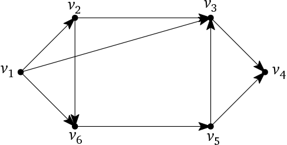

```{r setup, include=FALSE}
knitr::opts_chunk$set(echo = TRUE)
knitr::opts_chunk$set(comment = NA)
```

# Assignment Comments, Sample Solutions

## Don't count the enqueues/dequeues

- When BFS runs, there are lots of queue operations.
- Counting these won't work.
    - e.g., counting the marks will count the total number of vertices in the BFST.
    - Counting enqueues or dequeues will be even more than that.
- We need to keep track of the length of the shortest path from $(1,1)$. 
    - We want the *depth* of each element in the BFST. (Ultimately, we just want the depth of $(n,n)$.)

## Number Maze: Depth attribute

```{javascript, eval=FALSE}
NumberMaze(i, j, M): 

  initialize M[1..n, 1..n].moves to -1
  M[i,j].moves <- 0 
  Enqueue((i,j))
  
  while the queue is not empty:
    (x,y) <- Dequeue
    if 1 <= x <= n and 1 <= y <= n:
      ret <- (x,y).moves
      if (x,y) = (n,n):
        return ret
      checkIfMarked(x, y + M[x,y], ret)
      checkIfMarked(x, y - M[x,y], ret)
      checkIfMarked(x + M[x,y], y, ret)
      checkIfMarked(x - M[x,y], y, ret)
  return NO SOLUTION

checkIfMarked(x, y, moves):
  if M[x,y].moves = -1:
    M[x,y].moves <- ret
    Enqueue(x, y)
```

## Number Maze: stack of counters

Keep a stack of counters (or a stack of triples (i, j, counter)).

```{javascript, eval=FALSE}
MazeSolution(M[1...n, 1...n]){
  Initialize queues Coordinates and Counter
  Initialize Marked[1 .. n, 1 .. n] to hold all 0s
  Enqueue(1,1) on Coordinates
  Enqueue(0) on Counter
  while Coordinates is not empty
    (i,j) = Dequeue Coordinates
    v = M[i,j]
    c = (Dequeue Counter) + 1
    if Marked[i,j] = 0
      Marked[i,j] <- 1
      
      if i=n and j=n
        return c
      
      if 0 < i+v < n+1 and Marked[i+v, j] = 0
        Enqueue(i+v,j) on Coordinates, Enqueue(c) on Counter 
      if 0 < i-v < n+1 and Marked[i-v, j] = 0
        Enqueue(i-v,j) on Coordinates, Enqueue(c) on Counter 
      if 0 < j+v < n+1 and Marked[i, j+v] = 0
        Enqueue(i,j+v) on Coordinates, Enqueue(c) on Counter 
      if 0 < j-v < n+1 and Marked[i, j-v] = 0
        Enqueue(i,j-v) on Coordinates, Enqueue(c) on Counter 
  
  return NO SOLUTION
}
```

## Number Maze: counter/marker

Combine the counter and the marker:

```{javascript, eval=FALSE}
NumberMaze(M[1..n,1..n]):
  Enqueue((1,1), 0)
  initialize C[1..n,1..n] where every value is n^2
  while the queue is not empty
    (i,j), count <- Dequeue
    count <- count + 1
    if count < C[i,j]
      C[i,j] <- count
      val <- M[i,j]
      if i+val <= n
        Enqueue((i+val,j), count)
      if i-val >= 1
        Enqueue((i-val,j), count)
      if j+val <= n
        Enqueue((i,j+val), count)
      if j-val >= 1
        Enqueue((i,j-val), count)
  if C[n,n]==n^2
    return NO SOLUTION
  else
    return C[n,n]
```

## Time?

- (Obvious?) Fact: *The sum of the outdegrees equals the number of edges.* (also the sum of the indegrees)
    - There are $n^2$ vertices.
    - The maximum outdegree is 4.
    - So the number of edges is bounded above by $4n^2 \in O(n^2)$.
- DFS is $O(V+E)$. In this case, that's $O(n^2)$.

*Corollary:* In an undirected graph, the sum of the degrees is twice the number of edges.

## Implementation in R

```{r, message=FALSE}
library(dequer)
Mbook <- matrix(c(3,5,7,4,6,
                  5,3,1,5,3,
                  2,8,3,1,4,
                  4,5,7,2,3,
                  3,1,3,2,0), byrow = TRUE, nrow = 5)

minMoves <- function(s1,s2,M) {
  n <- nrow(M)
  marked <- matrix(rep(FALSE, n^2), nrow = n)
  q <- queue()
  pushback(q, c(s1,s2,0)) # third number is depth
  while(length(q) != 0) {
    v <- pop(q)
    i <- v[1]
    j <- v[2]
    depth <- v[3]
    if(!marked[i,j]) {
      marked[i,j] <- TRUE
      if(i==n && j==n)
        return(depth)
      x <- M[i,j]
      if(i+x <= n) pushback(q, c(i+x,j,depth+1))
      if(i-x >= 1) pushback(q, c(i-x,j,depth+1))
      if(j+x <= n) pushback(q, c(i,j+x,depth+1))
      if(j-x >= 1) pushback(q, c(i,j-x,depth+1))
    }
  }
  return("NO SOLUTION")
}

minMoves(1,1,Mbook)
```

## Implementation in Python

```{python}
import queue
import numpy as np
def ShortestPathCount(arr):
    q = queue.Queue()
    q.put((0,0))
    n = arr.shape[0] -1
    visited = np.zeros((n+1,n+1), dtype=bool)
    count = 0
    children = 0
    children_remaining = 1
    while q.qsize() > 0:
        val = q.get()
        first = val[0]
        second = val[1]
        if visited[first,second] == False:
            k = arr[first,second].copy()
            visited[first, second] = True
            if visited[n,n] == True:
                break
            if (first+k <= n):
                q.put((first+k,second))
                children += 1
            if (first-k >= 1):
                q.put((first-k,second))
                children += 1
            if (second+k <= n):
                q.put((first,second+k))
                children += 1
            if (second-k >= 1):
                q.put((first,second-k))
                children += 1
        children_remaining -= 1
        if children_remaining == 0:
            children_remaining = children
            children = 0
            count += 1
    if visited[n,n] == True:
        print(f"{count}")
    else:
        print("No possible path found")

path = np.array([[3,5,7,4,6],
                [5,3,1,5,3],
                [2,8,3,1,4],
                [4,5,7,2,3],
                [3,1,3,2,0]])
ShortestPathCount(path)
```

# Reduction and WFS

## Unknown Vertices

In many applications, the extent of the graph is unknown *a priori*.

- Paint Fill: We know how the pixels are connected locally, but we don't know the global shape that needs to be painted, until we search it.
- Number Maze: We know how to make a single move, but we don't know what squares are reachable until we run through the search.

> *We can operate as if we have an adjacency list, but it doesn't get discovered until we run a WFS.*

- **Note:** In these examples, we never had to actually build an adjacency list.
- The data was implicitly in the form of an adjacency list.  
    - Sometimes the data could be in the form of an adjacency matrix, too.

# DFS Revisited

## Recursive Definition

```{javascript, eval=FALSE}
DFS(v):
    if v is unmarked
        mark v
        for each edge vw
            DFS(w)
```

Not "exactly" the same as WFS with a stack:

- Unmarked vertices get marked as soon as the recursive call is made (i.e., right after `v` is pushed onto the recursion stack).
- Although it is important to realize that there is an adjacency list behind the scenes, we can often ignore the ordering in the linked lists.

## Starting and Finishing Times

Add a clock and two vertex attributes:

```{javascript, eval=FALSE}
DFS(v, clock):
    mark v
    clock <- clock + 1; v.pre <- clock
    for each edge vw
        if w is unmarked
            w.parent <- v
            clock <- DFS(w, clock)
    clock <- clock + 1; v.post <- clock
    return clock
```

- `v.pre` is the clock value when the vertex `v` is first discovered and marked.
    - Marks the beginning of the recursive call. (push)
- `v.post` is the clock value when we are done exploring `v`.
    - Marks the end of the recursive call. (pop)
- All the pre/post values are different (and sequential).

## Try it

1. Suppose the `DFS` algorithm is called on the following graph as `DFS(v1, 0)`. When a vertex `v` has more than one outgoing edge `vw`, assume that the `for`-loop considers the vertices `w` $=v_i$ in order of subscript. For each vertex `v`, compute `v.pre` and `v.post`.

<center>

</center>

2. How does the DFS spanning tree depend on the choice of initial vertex?

## Table Groups

```{r, echo=FALSE}
library(knitr)
roster <- c("Ethan", "Talia", "Drake", "Jack", "Andrew", "Blake", "Jordan", "Graham", "Kevin", "Logan", "Claire", "Bri", "Trevor", "James", "Kristen", "Levi", "Grace", "John", "Isaac", "Josiah", "Nathan")
set.seed(312021) 
n <- length(roster)
ngps <- 7
maxingp <- ceiling(n/ngps)
# just make random groups
groups <- matrix(c(roster[sample(n)], 
                   rep("",(maxingp - (n %% maxingp)) %% maxingp)), 
                 ncol=maxingp, byrow=FALSE)
rownames(groups) <- paste0("Table #", 1:nrow(groups))
kable(t(groups))
```

## Account for multiple components

- $v_1$ was a "lucky" choice.
    - e.g., if we had chosen $v_5$, we wouldn't have discovered all the vertices.
- `DFSAll` is a "wrapper" function that ensures that we get a spanning *forest* containing all the vertices of a graph $G$.

<div class="column-left">

</div>

<div class="column-right">

```{javascript, eval=FALSE}
DFSAll(G):
    clock <- 0
    for all vertices v
        unmark v
    for all vertices v
        if v is unmarked
            clock <- DFS(v, clock)
```

</div>

## Preorder and Postorder

Suppose we run `DFS` on a graph $G$.

- A *preordering* of the vertices is a listing of the vertices in order of `v.pre`.
- A *postordering* of the vertices is a listing of the vertices in order of `v.post`.

If $G$ is a tree, these notions are the same as preorder/postorder traversals.

# Organization of pre and post intervals

## Parentheses Theorem

For any two vertices `u` and `v`, exactly one of the following must hold:

- The intervals `[u.pre..u.post]` and `[v.pre..v.post]` do not overlap.
    - Neither is a *descendant* of the other in the depth-first forest.
- The interval `[u.pre..u.post]` is contained in `[v.pre..v.post]`.
    - `u` is a descendant of `v` in a depth-first tree.
- The interval `[v.pre..v.post]` is contained in `[u.pre..u.post]`.
    - `v` is a descendant of `u` in a depth-first tree.
    
Notice: `.pre` and `.post` must be nested like parentheses:

- ( )( ) for nonoverlapping intervals.
- (( )) for descendant intervals.

# Classification of Edges

## Four types of edges

Every edge `uv` in the graph is one of the following.

- **Tree edge:** `uv` is in a/the depth-first tree.
    - Happens when `DFS(u)` calls `DFS(v)` directly, so `u = v.parent`.
- **Forward edge:** `v` is a descendant of `u`, but not its child.
    - Happens when `u.pre` $<$ `v.pre` $<$ `v.post` $<$ `u.post`
        - (( ))
- **Back edge:** `uv` goes backwards up a depth-first tree.
    - Happens when `v.pre` $<$ `u.pre` $<$ `u.post` $<$ `v.post`
        - (( ))
- **Cross edge:** `uv` connects different branches in the depth-first forest.
    - Happens when `v.post` $<$ `u.pre`
        - ( )( )

## Make a forest

3. Draw a graph whose depth first forest consists of more than one tree, no matter where you start the `DFS`. In addition, make your graph complicated enough to have at least one of each type of edge: tree, forward, back, and cross.
