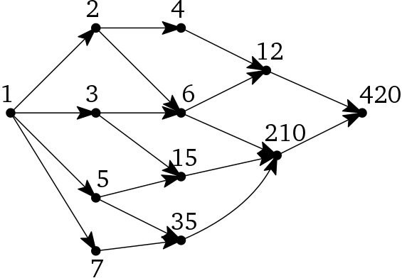

```{r setup, include=FALSE}
knitr::opts_chunk$set(echo = TRUE)
knitr::opts_chunk$set(comment = NA)
```

# Assignment Comments, Sample Solutions

## Interval diagram

```
[-------------------------v1-----------------------]
  [-------v2------] [-------------v6-------------]
     [----v3---]       [----------v5----------]
        [-v4-]             [------v7------]
                              [---v8---]
                                [-v9-]


1  2  3  4  5  6  7  8  9  10 11 12 13 14 15 16 17 18 19 20
```

<center>

</center>

## Edge Classification

- Tree edges: (v1,v2), (v2,v3), (v1,v6), (v6,v5), (v5,v7), (v7,v8), (v8,v9)

- Back edges: (v5,v6), (v9,v8)

- Cross edges: (v8,v4), (v9,v3), (v5,v4)

- There are no forward edges.

## Overlapping Trees

Two possible vertices are $v_2$ and $v_9$. The tree for $v_2$ would only have the root of $v_2$, $v_3$ as its child, and v4 as its grandchild. The tree for $v_9$ would have $v_9$ as the root with 2 children being $v_3$ and $v_8$, and then one more grandchild, $v_4$, attached to $v_3$. We see that both the trees have the $v_3$ and $v_4$ vertices, but they each have other vertices in their tree.

# DFS Starting and Finishing Times

## Starting and Finishing Times

Add a clock and two vertex attributes:

```{javascript, eval=FALSE}
DFS(v, clock):
    mark v
    clock <- clock + 1; v.pre <- clock
    for each edge vw
        if w is unmarked
            w.parent <- v
            clock <- DFS(w, clock)
    clock <- clock + 1; v.post <- clock
    return clock
```

- `v.pre` is the clock value when the vertex `v` is first discovered and marked.
    - Marks the beginning of the recursive call. (push)
- `v.post` is the clock value when we are done exploring `v`.
    - Marks the end of the recursive call. (pop)
- All the pre/post values are different (and sequential).

## Preorder and Postorder

Suppose we run `DFS` on a graph $G$.

- A *preordering* of the vertices is a listing of the vertices in order of `v.pre`.
- A *postordering* of the vertices is a listing of the vertices in order of `v.post`.

If $G$ is a tree, these notions are the same as preorder/postorder traversals.

## Parentheses Theorem

For any two vertices `u` and `v`, exactly one of the following must hold:

- The intervals `[u.pre..u.post]` and `[v.pre..v.post]` do not overlap.
    - Neither is a *descendant* of the other in the depth-first forest.
- The interval `[u.pre..u.post]` is contained in `[v.pre..v.post]`.
    - `u` is a descendant of `v` in a depth-first tree.
- The interval `[v.pre..v.post]` is contained in `[u.pre..u.post]`.
    - `v` is a descendant of `u` in a depth-first tree.
    
Notice: `.pre` and `.post` must be nested like parentheses:

- ( )( ) for nonoverlapping intervals.
- (( )) for descendant intervals.

## Four types of edges

Every edge `uv` in the graph is one of the following.

- **Tree edge:** `uv` is in a/the depth-first tree.
    - Happens when `DFS(u)` calls `DFS(v)` directly, so `u = v.parent`.
- **Forward edge:** `v` is a descendant of `u`, but not its child.
    - Happens when `u.pre` $<$ `v.pre` $<$ `v.post` $<$ `u.post`
        - (( ))
- **Back edge:** `uv` goes backwards up a depth-first tree.
    - Happens when `v.pre` $<$ `u.pre` $<$ `u.post` $<$ `v.post`
        - (( ))
- **Cross edge:** `uv` connects different branches in the depth-first forest.
    - Happens when `v.post` $<$ `u.pre`
        - ( )( )

# Detecting cycles

## Is an edge part of a cycle?

- Suppose there is a directed edge `u` $\rightarrow$ `v` from `u` to `v`.
    - If the interval `[u.pre..u.post]` is contained in `[v.pre..v.post]`, then `u` is a descendant of `v` in a depth-first tree.
        - This can only happen if `u.post` $<$ `v.post`.
        - So `uv` is a back edge.
        - So there is a path from `v` to `u`.
        - So `uv` is part of a cycle.
- Conversely, every cycle must contain a back edge.

So we can determine if a graph contains a cycle:

```
DoesGraphHaveACycle(G)
    for each edge uv in G:
        if u.post < v.post return "Graph has a cycle"
    return "Graph has no cycles"    
```

## Fancier Cycle checker

```{javascript, eval=FALSE}
                                              DFS(v, clock):
                                                  mark v
                                                  clock <- clock + 1; v.pre <- clock
                                                  for each edge vw
                                                      if w is unmarked
                                                          w.parent <- v
                                                          clock <- DFS(w, clock)
                                                  clock <- clock + 1; v.post <- clock
                                                  return clock
```


```{javascript, eval=FALSE}
// wrapper:                                   // Modified DFS:
IsAcyclic(G):                                 IsAcyclicDFS(v):
    for all vertices v                            v.status <- Active
        v.status <- New                           for each edge vw
    for all vertices v                                if w.status = Active
        if v.status = New                                 return False
            if IsAcyclicDFS(v) = False                else if w.status = New
                return False                              if IsAcyclicDFS(w) = False
    return True                                               return False
                                                  v.status <- Finished
                                                  return True
```

## DAGs

A directed graph *without cycles* is called a **directed acyclic graph** (DAG).

# Topological Sorting

## Topological ordering

Suppose $G$ is a DAG.

- A *topological ordering* of $G$ is an ordering $\prec$ of the vertices such that $u \prec v$ for every edge $u \rightarrow v$.
- In other words, it is a listing of the vertices that respects the arrows.
    - List the vertices in reverse order of `.post`. (Reverse postordering)

See Figure 6.8.

```
TopologicalSort(G):
    Call DFSAll(G) to compute finishing times v.post for all v in G
    Return vertices in order of decreasing finishing times
```

## DFSAll and Topological Sort

```
DFS(v, clock):
    mark v
    clock <- clock + 1; v.pre <- clock
    for each edge vw
        if w is unmarked
            w.parent <- v
            clock <- DFS(w, clock)
    clock <- clock + 1; v.post <- clock
    return clock
    
DFSAll(G):
    clock <- 0
    for all vertices v
        unmark v
    for all vertices v
        if v is unmarked
            clock <- DFS(v, clock)
            
TopologicalSort(G):
    Call DFSAll(G) to compute finishing times v.post for all v in G
    Return vertices in order of decreasing finishing times
```


## {data-background="http://blog.hockeyworld.com/wp-content/uploads/2016/04/BqU3DSECYAA_uG9.jpg" data-background-size="contain"}

## Sources and Sinks

- A vertex in a DAG that has no incoming edges is called a *source*.
- A vertex in a DAG that has no outgoing edges is called a *sink*.
    - So isolated vertices are both sources and sinks.
    
Facts: 

- Every DAG has at least one source and at least one sink.
- Every topological ordering starts with a source and ends with a sink.

## Applications of Topological Sorting

- Dependencies
    - If task $u$ must be done before task $v$, there's an edge $u\rightarrow v$.
    - A topological ordering gives a possible ordering of tasks.
        - Makefiles: Compilation ordering
        - Linkers: Symbol dependencies
        
# Try It

## Table Groups

```{r, echo=FALSE}
library(knitr)
roster <- c("Ethan", "Talia", "Drake", "Jack", "Andrew", "Blake", "Jordan", "Graham", "Kevin", "Logan", "Claire", "Bri", "Trevor", "James", "Kristen", "Levi", "Grace", "John", "Isaac", "Josiah", "Nathan")
set.seed(332021) 
n <- length(roster)
ngps <- 7
maxingp <- ceiling(n/ngps)
# just make random groups
groups <- matrix(c(roster[sample(n)], 
                   rep("",(maxingp - (n %% maxingp)) %% maxingp)), 
                 ncol=maxingp, byrow=FALSE)
rownames(groups) <- paste0("Table #", 1:nrow(groups))
kable(t(groups))
```

## Topological sort this DAG

1. Consider the following directed, acyclic graph (DAG). Perform the topological sort algorithm on this DAG. Start at 1. When calling `DFS`, assume that the for-loops consider the vertices in numerical order. Include the starting and finishing times for each vertex. 

<center>

</center>

## What relation is it?

2. How many sources and sinks are there in this DAG?

3. Now suppose `DFSAll` considers vertex 6 first, and then vertex 1. Repeat question 1, and note any differences.

4. What relation does this DAG model? Are there other topological orderings for this DAG?

