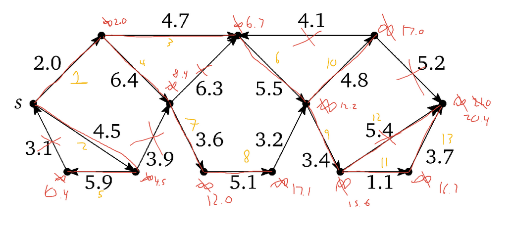

```{r setup, include=FALSE}
knitr::opts_chunk$set(echo = TRUE)
knitr::opts_chunk$set(comment = NA)
```

# Assignment Comments

## Single Source Shortest Path

```
InitSSSP(s):                          Relax(uv):
    dist(s) <- 0                          dist(v) <- dist(u) + w(uv)
    pred(s) <- Null                       pred(v) <- u
    for all vertices v != s
        dist(v) <- Infinity
        pred(v) ← Null
        
MetaSSSP(s):
    InitSSSP(s)
    while there is at least one tense edge      // NOTE: need to specify how to check
        Relax any tense edge                    // NOTE: need to specify how to choose
```

## Dijkstra's Algorithm

```
DijkstraSSSP(s):
    InitSSSP(s)
    for all vertices v
        Insert(v, dist(v))
    while the priority queue is not empty
        u <- ExtractMin()
        for all edges uv
            if uv is tense
                Relax(uv)
                DecreaseKey(v, dist(v))
```

## Step Through Dijkstra's Algorithm

Relaxation order: 2.0, 4.5, 4.7, 6.4, 5.9, 5.5, 3.6, 5.1, 3.4, 4.8, 1.1, 5.4, 3.7



## Looped Trees

- Every leaf has an edge back to the root.
- Otherwise, $G$ is a binary tree with $n$ vertices and $n-1$ edges.
    - There are about $n/2 = \Theta(n)$ leaves.
    - So there are $n-1 + \Theta(n) = O(n)$ edges in the looped tree.
- Dijkstra Time: $O(E \log V) = O(n \log n)$.

## Faster shortest path algorithm

- If $u$ is above $v$, then BFS (starting at $u$) will find the (only) path in $O(n)$ time.
- If $v$ is above $u$, the the shortest path will be the shortest path from $u$ to the root, followed by the only path from the root to $v$.
    - Consider the reversal graph ($O(n)$). 
    - BFS, starting at root. Mark each node with a `distanceFromRoot` attribute.
        - If new distance is less than marked distance, update, and update parents. 
        - $O(n)$, because each node is only ever going to be marked twice.
    


# Shortest Paths

## Tentative Shortest Paths and Predecessors

- $s$ is the start vertex.
- $s \rightsquigarrow v$ is the **tentative shortest path** from $s$ to $v$.
- $\text{dist}(v)$ is the **weight** of the tentative shortest path $s \rightsquigarrow v$.
- $\text{pred}(v)$ is the **predecessor** of $v$ in $s \rightsquigarrow v$.
- $\text{dist}(v)$ is the *weight* of the tentative shortest path $s \rightsquigarrow v$.
- $\text{pred}(v)$ is the *predecessor* of $v$ in $s \rightsquigarrow v$.

An edge $u\rightarrow v$ is called **tense** if $\text{dist}(u) + w(u\rightarrow v) < \text{dist}(v)$.

## SSSP by Repeated Relaxing: Meta-Algorithm

```
InitSSSP(s):                          Relax(uv):
    dist(s) <- 0                          dist(v) <- dist(u) + w(uv)
    pred(s) <- Null                       pred(v) <- u
    for all vertices v != s
        dist(v) <- Infinity
        pred(v) ← Null
        
MetaSSSP(s):
    InitSSSP(s)
    while there is at least one tense edge      // NOTE: need to specify how to check
        Relax any tense edge                    // NOTE: need to specify how to choose
```

- `pred(v)` and `dist(v)` get updated as the algorithm `metaSSSP` runs.
    - So edges that were tense become not tense.
- **Correctness:** We need to prove that, if there are no tense edges, then the *tentative shortest path* $s \rightarrow \cdots \rightarrow \text{pred}(\text{pred}(v)) \rightarrow \text{pred}(v) \rightarrow v$ is in fact a shortest path from $s$ to $v$.


## Table Groups

```{r, echo=FALSE}
library(knitr)
roster <- c("Ethan", "Talia", "Drake", "Jack", "Andrew", "Blake", "Jordan", "Graham", "Kevin", "Logan", "Claire", "Bri", "Trevor", "James", "Kristen", "Levi", "Grace", "John", "Isaac", "Josiah", "Nathan")
set.seed(462021) 
n <- length(roster)
ngps <- 7
maxingp <- ceiling(n/ngps)
# just make random groups
groups <- matrix(c(roster[sample(n)], 
                   rep("",(maxingp - (n %% maxingp)) %% maxingp)), 
                 ncol=maxingp, byrow=FALSE)
rownames(groups) <- paste0("Table #", 1:nrow(groups))
kable(t(groups))
```

## Predecessor paths

1. Suppose that $s = \text{pred}(v) = \text{pred}(u)$, but the path $s \rightarrow v$ is longer than the path $s \rightarrow u \rightarrow v$. Which edge is tense?

2. Suppose that $s \rightarrow \cdots \rightarrow \text{pred}(\text{pred}(v)) \rightarrow \text{pred}(v) \rightarrow v$ is not a shortest path from $s$ to $v$. That is, suppose there is a shorter path $s \rightarrow u_1 \rightarrow u_2 \rightarrow \cdots \rightarrow u_k \rightarrow v$.
    a. Explain why you can relax the edges in order $su_1, u_1u2, \ldots, u_{k-1}u_k$.
    b. Once you have done that, which edge is tense?

# Shortest paths in DAGs

## Recall: DAGs

- A directed graph *without cycles* is called a **directed acyclic graph** (DAG).
- A *topological ordering* of $G$ is an ordering $\prec$ of the vertices such that $u \prec v$ for every edge $u \rightarrow v$.
- In other words, it is a listing of the vertices that respects the arrows.

```
TopologicalSort(G):
    Call DFSAll(G) to compute finishing times v.post for all v in G
    Return vertices in order of decreasing finishing times
```

So we can topologically sort the vertices in $O(V+E)$ time.

## Shortest Paths in DAGs

Recursive Structure: Compute the length of the shortest path from $s$ to $v$.

```
LengthSP(v):
    if v = s
        return 0
    else
        minLength <- Infinity
        for all edges uv
            tryLength <- LengthSP(u) + w(uv)
            if tryLength < minLength
                minLength <- tryLength
```

- If your graph has a cycle, this might never finish.
- If your graph is a DAG, it will.

## Dynamic Programming

- Let `v[1..n]` be the vertex set in topological order. (`s = v[1]`)
- Memoize: Let `LSP[1..n]` be the length of the shortest path.
- Evaluation order: `LSP[v]` depends on `LSP[u]` for $u \prec v$.

```
DagSSSP(s):
    for all vertices v in topological order
        if v = s
            LSP(v) <- 0
        else
            LSP(v) <- Infinity
            for all edges uv
                if LSP(v) > LSP(u) + w(uv)
                    LSP(v) <- LSP(u) + w(uv)
                    pred(v) <- u
```

Secretly, `LSP[i]` is the same as `dist(v[i])`. See Figure 8.9.

## `DagSSSP` time

```
DagSSSP(s):
    for all vertices v in topological order   // O(V + E)
        if v = s
            LSP(v) <- 0
        else
            LSP(v) <- Infinity
            for all edges uv                  // need rev(G) to do this
                if LSP(v) > LSP(u) + w(uv)   
                    LSP(v) <- LSP(u) + w(uv)
                    pred(v) <- u
```

- Recall `rev(G)` can be computed in $O(V+E)$ time.
- Constant time work on each edge.

Total Time: $O(V+E)$